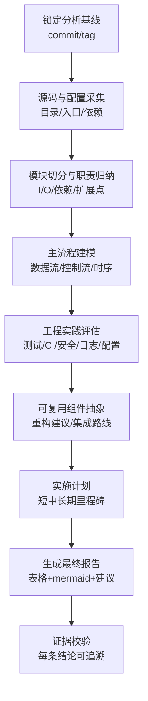
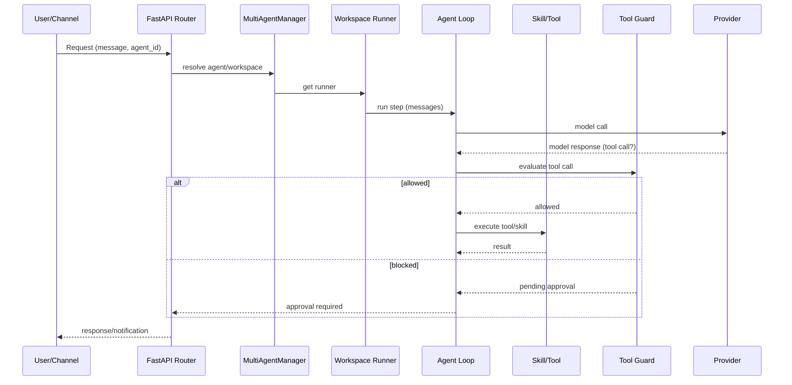
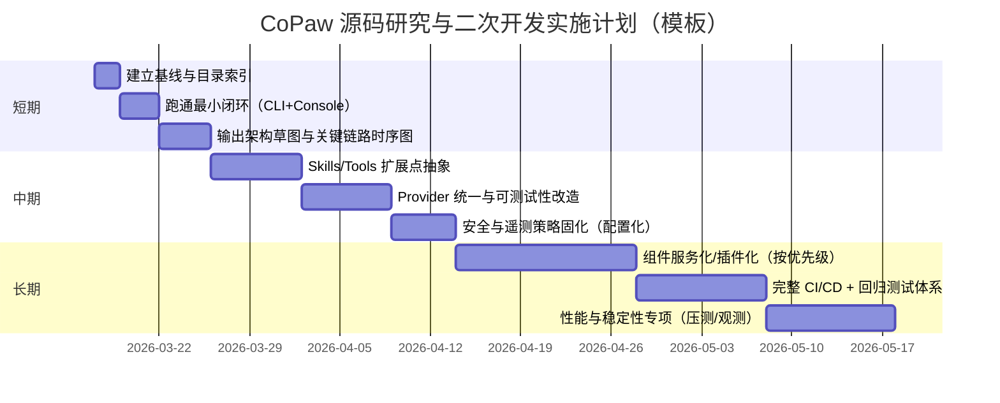

# CoPaw 源码深度研究分析任务说明

## 执行摘要

本任务说明用于指导你（或自动化研究系统）对 CoPaw 代码库进行“以源码为主、证据可追溯”的深度分析，产出一份中文分析报告，覆盖架构、模块交互、功能点、技术栈与依赖、工程实践与代码质量、可复用组件与扩展方案、以及分阶段实施计划等维度。任务特别强调：以仓库中的源码、README、配置文件、Issues/PR/Discussions、官方文档与注释为最高优先级；所有结论必须绑定可复现证据（提交哈希、文件路径、行号/片段）。该仓库呈现“Python 后端 + TypeScript 前端控制台 + 多渠道接入 + 可扩展 Skills + 多模型 Provider + 多智能体管理”的形态与目录结构，且包含 Docker/CI/发布流水线等工程要素，可直接作为你构建 agent 应用的可参考样板。citeturn1view0turn3view0turn4view0turn7view0turn22view0turn26view0

## 假设与约束

本节的目的是：把“分析必须依赖但用户未给出”的前提显式写出来，并统一用“未指定”标注，避免在后续架构推导中引入隐性假设。

下表是**任务执行期的假设登记模板**（在实际执行分析时，需先填写/确认；无法确认则保持“未指定”）：

| 类别 | 当前状态 | 对分析/实现的影响 | 需要补充的信息 |
|---|---|---|---|
| 运行操作系统 | 未指定 | 影响桌面端、文件系统、进程管理与脚本兼容性（Windows/macOS/Linux） | 目标 OS、最低版本 |
| 运行方式 | 未指定 | 影响部署与调试路径（源码运行 / pip 包 / Docker 镜像） | 你偏好哪种方式 |
| 目标平台形态 | 未指定 | 影响架构关注点（本地单机、局域网、云、K8s、Serverless） | 是否需要云部署/多租户 |
| LLM/模型来源 | 未指定 | 影响 provider、鉴权、费用与延迟；也影响可测试性 | 使用 OpenAI/Anthropic/本地模型等哪类 |
| 数据与隐私约束 | 未指定 | 影响日志、遥测、存储加密、对外联机策略 | 是否必须离线/是否允许匿名遥测 |
| 规模与性能目标 | 未指定 | 影响并发、任务调度、队列设计、缓存与限流 | 目标并发、延迟、吞吐 |
| 你现有项目的技术栈 | 未指定 | 影响“可复用组件”抽象边界与集成路线 | 语言/框架/模块化方式 |

同时，这个仓库自身存在一些**可从源码/配置直接读到的硬约束**（不是“我方假设”），它们会影响环境准备与复现方式，例如：

- Python 版本约束：`>=3.10,<3.14`。citeturn3view0  
- 后端为 FastAPI 应用，并与 `agentscope_runtime.engine.app.AgentApp` 集成，体现它依赖 AgentScope 生态的运行时抽象。citeturn26view0turn3view0  
- 仓库顶层包含 `console/`（TypeScript 前端）、`src/copaw/`（Python 后端主包）、`tests/`、`deploy/`、`.github/workflows/` 等，说明项目是“全栈 + 部署 + CI”的组织方式。citeturn1view0turn7view0turn4view0turn18view0turn22view0turn19view0  
- Docker Compose 默认将服务端口映射到本机 `8088`（绑定 `127.0.0.1`），并挂载 data/secrets 卷。citeturn20view1  

## 研究对象与资料优先级

本任务要求“证据优先级”要写入执行流程，避免后续分析被二手解读误导。建议使用如下优先级顺序：

最高优先级（必须逐条扫描并引用证据）  
- 源码：`src/copaw/` 下各模块（agents/app/cli/providers/security 等）。citeturn4view0turn8view0turn6view0turn10view0turn9view0turn5view0  
- 构建与依赖声明：`pyproject.toml`（Python 依赖/可选 extras/pytest 配置）、`console/package.json` 与 lockfile（前端依赖）。citeturn3view0turn7view0  
- 配置与部署：`docker-compose.yml`、`deploy/`、以及工作流文件（CI/CD）。citeturn20view1turn19view0turn22view0  
- README（中英日）：功能描述、安装方式、遥测说明、版本发布信息。citeturn1view0turn2view0  

次优先级（用于解释设计动机、边界条件、未决问题）  
- Issues / PR / Discussions（尤其 Roadmap、Pinned 讨论、设计讨论、重大变更）。citeturn0search2turn0search4turn0search8  
- 官方文档站点（README 已给出文档入口）；用于补全配置字段意义、接入渠道步骤、使用约束。citeturn1view0turn2view0  

必要时才引用（用于解释第三方组件行为、协议标准等）  
- 关键依赖的官方文档（如 FastAPI、Playwright、APScheduler、各渠道 SDK 等）；优先中文资料，若缺失再用英文。依赖清单可从 `pyproject.toml` 直接枚举。citeturn3view0turn26view0  

## 执行流程与方法

本节定义“研究系统/执行者”应如何一步步从仓库生成目标报告，强调可复现、可验收。

### 全流程任务管线

建议将研究拆成“采集→建模→验证→输出”的闭环，并把产物拆解成可独立验收的中间件（目录索引、接口清单、数据流/控制流图、依赖树、用例序列图、风险清单等）。



### 环境准备与基线锁定

任务要求在报告中明确“基于哪个版本/提交”进行分析（否则后续你做代码级审查会对不上）。

- 基线选择策略  
  - 默认：分析 `main` 分支当前 HEAD（但必须记录 commit hash）。citeturn1view0  
  - 若你偏好稳定：改为“最新 Release 标签”作为基线（README 中显示近期发布 v0.0.7，且 Release 页面汇总变更）。citeturn1view0turn0search1  

- 代码获取（示例命令，仅作执行入口；实际可能按你环境调整）  
```bash
git clone https://github.com/agentscope-ai/CoPaw.git
cd CoPaw
git rev-parse HEAD
```

- 快速“入口点定位”清单（用于后续从入口回溯全链路）  
  - Python CLI 入口：`copaw = "copaw.cli.main:cli"`；且支持 `python -m copaw`。citeturn3view0turn23view0turn24view0  
  - 服务端应用入口：`src/copaw/app/_app.py` 中创建 FastAPI 实例，并在 lifespan 中做初始化/迁移/多智能体管理挂载。citeturn26view0  
  - 前端控制台入口：`console/`（Vite/TS 项目结构），最终静态资源被打包进 Python 包的 `console/**`。citeturn7view0turn3view0turn26view0  

### 模块切分策略

以仓库现状为准，先按目录做“粗切分”，再在每个模块内部用“入口文件 + 路由/注册点 + 关键类/协议”做“细切分”。

- 顶层目录粗切分（示例）  
  - 后端主包：`src/copaw/`，包含 `agents/ app/ cli/ providers/ local_models/ security/ token_usage/ tunnel/ config/ utils/ envs/` 等。citeturn4view0turn6view0turn8view0turn10view0turn11view0turn15view0turn16view0turn17view0turn12view0turn13view0  
  - 前端控制台：`console/`。citeturn7view0  
  - 测试：`tests/`（分 integrated 与 unit/providers）。citeturn18view0  
  - 部署：`deploy/`、`docker-compose.yml`。citeturn19view0turn20view1  
  - CI/CD：`.github/workflows/`（包含 tests、发布 PyPI、Docker、桌面端 release 等流水线）。citeturn22view0  

- 细切分建议（以“可画图/可列接口”为目标）  
  - `cli/`：以 `main.py` 为 root，列出所有 command group（app/channels/chats/cron/env/providers/skills/desktop 等），并为每个命令找到其调用到的 API/内部模块。citeturn24view0turn5view0  
  - `app/`：以 `_app.py`、`routers/`、`runner/`、`workspace*`、`multi_agent_manager` 为主线，梳理服务启动与请求路径如何路由到“具体 agent/workspace”。citeturn26view0turn6view0turn27view0  
  - `agents/`：以 `react_agent.py`、`skills_manager.py`、`tools/`、`memory/`、`routing_chat_model.py`、`tool_guard_mixin.py` 为主线，梳理 agent loop、工具调用、技能加载与记忆读写。citeturn8view0  
  - `providers/`：梳理 provider 抽象（`provider.py`）、provider 管理（`provider_manager.py`）、各厂商与本地 provider（OpenAI/Anthropic/Ollama 等），以及重试包装（`retry_chat_model.py`）。citeturn10view0turn3view0  
  - `security/`：结合 README 中 v0.0.7 提到的 Tool Guard 安全层与源码目录，梳理“拦截/审批/规则”的实现与扩展点。citeturn1view0turn9view0turn3view0turn8view0  
  - `tunnel/`：梳理对外暴露/隧道相关能力（如 cloudflare）。citeturn15view0  
  - `token_usage/` 与 `tokenizer/`：梳理 token 统计来源、模型 wrapper 介入点、以及 tokenizer 资源如何被加载使用。citeturn13view0turn14view0turn3view0  
  - `utils/telemetry.py`：梳理遥测开关、采集字段、触发时机，与 README 的声明是否一致。citeturn17view0turn1view0  

### 数据流与控制流建模要求

为了满足你“更好地做 AI agent 基于该项目源码进行深入研究”的目标，建议将建模重点放在三条主链路：

- 用户输入链路（多渠道/控制台/CLI）→ 请求进入 FastAPI → 选定 agent/workspace → Agent loop → Provider 调用 → 工具/技能执行 → 输出回写各渠道。该项目存在“按 agent_id 动态路由 runner”的机制，应作为控制流关键点。citeturn26view0turn27view0  
- Skill 生命周期：发现（workspace/内置目录）→ 加载 → 注册为 tool/能力 → 执行 → 结果持久化/审计。README 与 `pyproject.toml` 显示 `agents/skills/**` 被作为 package data 打包，意味着“内置技能 + 工作区技能”是第一等扩展点。citeturn3view0turn1view0turn8view0  
- 安全与审批链：Tool Guard/skill 扫描规则（从 package data 规则路径可见）→ 拦截危险调用 → 等待用户批准 → 放行/拒绝。citeturn1view0turn3view0turn9view0turn8view0  

在最终报告中，这三条链路都必须能落到“关键入口函数/类 + 路由/注册点 + 关键数据结构”，并用 mermaid 画出流程/序列图。

## 输出物规格与模板

本节明确：研究系统最终要交付什么、每个维度怎么呈现、用什么表格/图来保证可读性与可复查性。

### 最终分析报告的结构约束

建议把用户要求的多个维度合并为 **四到八个**一级章节（每章可含若干子节），以保证信息密度与可读性（例如：架构、功能、依赖、工程质量、复用与改造路线、实施计划）。该结构也更贴近当前仓库“后端/前端/渠道/模型/安全/部署”的实际构成。citeturn4view0turn6view0turn7view0turn10view0turn9view0turn22view0  

### 模块清单表格模板

要求对 `src/copaw/` 下每个一级模块（至少：agents、app、cli、providers、local_models、security、token_usage、tunnel、config、utils、envs）给出如下表格（示例字段）：

| 模块 | 职责边界 | 主要入口 | 输入 | 输出 | 关键依赖 | 扩展点 | 风险点 |
|---|---|---|---|---|---|---|---|
| app | FastAPI 服务、路由与生命周期 | `_app.py` | HTTP 请求、header(agent_id)、config | HTTP 响应、静态资源 | agentscope-runtime、FastAPI、ProviderManager | 新 router、新中间件 | 启动迁移、状态一致性 |
| providers | 模型提供商抽象与调用 | `provider_manager.py` | prompt/messages、provider config | model response、usage | OpenAI/Anthropic/Ollama SDK | 新 provider | 重试、限流、密钥泄露 |
| agents | agent loop、skills/tools、记忆 | `react_agent.py` 等 | 用户消息、工具结果 | agent 输出、动作序列 | agentscope、reme-ai | 新 skill/tool | 工具安全、提示注入 |

模块枚举与入口文件必须以仓库实际文件为准（目录与文件名可从 GitHub 列表直接获取）。citeturn4view0turn6view0turn8view0turn10view0turn11view0turn9view0turn13view0turn15view0turn16view0turn17view0turn12view0  

### 关键用例序列图模板

至少选取以下三类关键用例（名称可调整，但链路需覆盖“多智能体、技能、工具安全、provider”）：

- 控制台聊天 → 选择 agent → 调用模型 → 输出  
- 定时任务（cron）→ 触发 skill → 输出到某个 channel  
- 工具调用被 Tool Guard 拦截 → 用户批准 → 放行执行  

示例（模板）：



其中 `agent_id` 动态路由 runner 的机制，在 `_app.py` 中已有明确描述，应在实际序列图中落地到对应中间件/上下文实现。citeturn26view0  

### 依赖树表格模板与范围

依赖必须至少覆盖：

- Python 主依赖（`[project].dependencies`）与可选 extras（`[project.optional-dependencies]`）。citeturn3view0  
- 前端依赖（`console/package.json` 与 lockfile）。citeturn7view0  
- 运行与部署依赖（Dockerfile、Compose、脚本安装、CI 工作流）。citeturn19view0turn20view1turn22view0turn1view0  

Python 依赖表示例（片段化展示，完整清单需在执行时从 `pyproject.toml` 枚举）：

| 依赖 | 版本/约束 | 用途推断（需在源码中验证） | 潜在替代 |
|---|---|---|---|
| agentscope | ==1.0.16.dev0 | agent 框架抽象 | LangChain/LlamaIndex（取决于架构偏好） |
| agentscope-runtime | ==1.1.0 | 运行时/AgentApp 集成 | 自建 runtime（成本更高） |
| fastapi/uvicorn | （fastapi 在源码中引用；uvicorn 在依赖中） | API 服务与 ASGI 部署 | Starlette/Sanic 等 |
| apscheduler | >=3.11.2,<4 | 定时任务 | celery beat / cron + worker |
| playwright | >=1.49.0 | 自动化/抓取类能力 | selenium / requests + bs4 |
| transformers/onnxruntime | transformers>=4.30.0, onnxruntime<1.24 | 本地模型/推理或工具 | llama.cpp/MLX/其他推理栈 |

依赖与版本约束来自 `pyproject.toml`，其中包含 `agentscope-runtime`、`apscheduler`、`playwright`、`transformers`、`onnxruntime` 等条目。citeturn3view0turn26view0  

### 实施计划时间线模板

最终报告中必须提供短/中/长期三阶段计划，并用甘特图表达（以下为模板，具体任务项需在分析完成后填充）：



## 证据采集、引用与验收标准

### 证据采集与引用规范

为满足“优先使用源码、README、Issues、PR、官方文档与注释”的要求，建议统一采用“三段式证据引用”：

- 证据 ID：`<commit-hash>:<path>#Lx-Ly`（或 GitHub permalink）  
- 证据类型：源码 / 配置 / 文档 / issue / PR / discussion / release note  
- 结论绑定：每个架构结论、接口说明、行为断言，都必须在正文附近给出证据 ID（避免统一堆在附录）

特别注意：仓库中存在 README 的遥测说明，且代码中存在 `utils/telemetry.py`，这类“隐私/数据采集”相关结论属于高敏结论，必须做到“声明 vs 实现”双证据对照。citeturn1view0turn17view0  

### 验收标准

任务完成的最低验收线建议如下（用于你验收研究系统输出是否合格）：

- 报告开头包含执行摘要，并明确“分析基线 commit/tag”。citeturn1view0turn0search1  
- “我方假设”清单完整：所有未给出信息均标注“未指定”，且不会在后文被隐式假设替代。  
- 软件架构章节包含：高层架构图 + 模块交互流程图 + 至少一个关键用例序列图（mermaid），并能落到实际模块（例如 app/routers、providers、agents、security）。citeturn6view0turn27view0turn10view0turn8view0turn9view0turn26view0  
- 技术栈与依赖章节包含：Python 依赖树表（含版本与用途）、前端依赖/构建工具说明、CI/CD 说明（workflow 列表与其职责）。citeturn3view0turn7view0turn22view0  
- 工程实践章节至少覆盖：测试结构与可测试性（tests 目录现状）、日志/配置/错误处理、安全与隐私（含 Tool Guard 与遥测）。citeturn18view0turn17view0turn1view0turn9view0turn8view0  
- 结尾包含**5 条具体可执行建议与下一步行动项**（必须可落地、可安排到实施计划里），并有明确优先级与风险提示。

以上任务说明已结合仓库可见结构（后端模块划分、前端控制台、FastAPI+AgentApp 集成、Provider/本地模型/安全/隧道/Token 统计、Docker 与 CI 工作流）对分析流程做了可执行化约束。citeturn4view0turn7view0turn26view0turn10view0turn11view0turn9view0turn15view0turn13view0turn20view1turn22view0