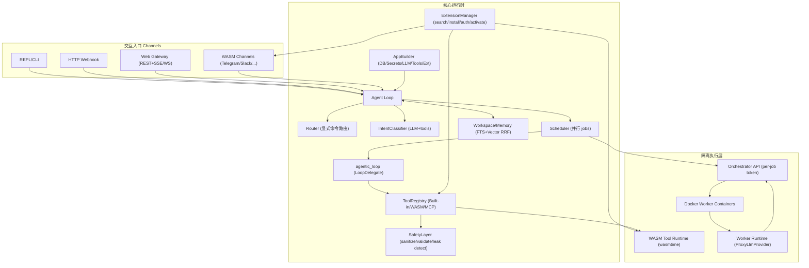

# IronClaw 仓库源码深度研究报告

## 执行摘要

IronClaw 是一个以“本地优先 + 安全优先”为核心原则的个人 AI 助手/Agent 运行时框架：它把交互入口（CLI、HTTP webhook、Web 网关、WASM 渠道）统一接入主 Agent Loop，并通过**可插拔的工具系统（Built-in / WASM / MCP）**与**分层安全机制（提示注入防护、密钥泄漏检测、能力/网络白名单、Docker/WASM 隔离）**实现自扩展能力与数据保护。citeturn8view0turn37view0turn31view0turn42view0

从源码结构看，IronClaw 的架构亮点集中在三处：  
（1）**AppBuilder 五阶段初始化**把 DB/Secrets/LLM/Tools+Workspace/Extensions 机械化拆解，便于测试、复用与演进；citeturn23view0turn24view2  
（2）**统一的 agentic_loop 引擎**用 `LoopDelegate` 把“LLM→工具→结果→上下文→循环”的核心闭环抽象出来，被聊天、作业 worker、容器 runtime 复用；citeturn40view0turn39view1  
（3）**扩展系统 Extensions**把“渠道（WASM）/工具（WASM）/MCP servers”统一成用户可见的“扩展”，支持运行时搜索、安装、认证、激活；citeturn43view1turn24view2turn26view0

面向“独立开发者要做更强 AI agent”的建议：优先沿用其**能力声明（capabilities.json）**与**安全边界（网络面清单 + 常量时间 token 校验 + 每作业密钥授权）**的思想，同时在“多智能体协作、长程任务规划、可观测性/评测闭环、并发与资源治理”四个方向做增强（下文给出可落地的架构改造与集成方案）。citeturn42view0turn43view2turn40view0turn37view2

## 项目概览

**目标与定位**：IronClaw 的 README 明确定位为“可信任的个人 AI 助手”，强调数据本地保存/加密、开源可审计、可自扩展工具以及纵深防御。citeturn8view0turn8view1turn7view0

**版本与发布形态**：仓库 `Cargo.toml` 显示主包版本为 `0.18.0`、Rust edition 2024，声明 `rust-version = "1.92"`；同时 README 给出安装方式（脚本/PowerShell/Homebrew/源码编译）与数据库前置（PostgreSQL + pgvector）。citeturn7view0turn8view0turn35search6

**分支/交付流程（从 CI 推断）**：存在面向 staging 的批处理 CI，会检测新提交、运行测试/E2E、自动创建“promotion PR”，并等待/解析“Claude Code Review”结果，发现高严重度问题可阻断晋级。该流程与 release 记录中“promote staging to main”的条目相互印证。citeturn17view0turn17view1turn35search6

**主要模块与目录结构（以源码/目录清单为准）**：`src/` 下的关键目录包括 `agent/`、`channels/`、`tools/`、`extensions/`、`llm/`、`workspace/`、`orchestrator/`、`worker/`、`sandbox/` 等。citeturn20view0turn25view0turn26view3turn27view0turn28view0turn29view0turn29view2turn34view0

**模块列表与职责对照表（仓库内明确注释优先；无法从注释直接确认者标注“未指定”）**：citeturn20view0turn23view2turn23view0turn37view0turn39view0turn42view0turn43view1

| 模块/目录 | 职责（来源于模块注释/关键入口） | 关键入口/接口（示例） |
|---|---|---|
| `src/main.rs` | 程序入口：CLI 命令分发、按配置装配 channels、启动 Agent、初始化 Web 网关/统一 webhook server、热激活 WASM 渠道等 | `async_main()`、`Agent::new()`、`ChannelManager` 装配citeturn21view0turn22view1 |
| `src/app.rs` | AppBuilder：把初始化拆为 5 阶段（DB→Secrets→LLM→Tools+Workspace→Extensions），便于测试与复用 | `AppBuilder::build_all()`、`init_*` 五阶段citeturn23view0turn24view2 |
| `src/agent/` | 主 Agent Loop（会话/路由/调度/心跳/例行任务/自修复）：协调消息、作业与工具调用 | `Agent`、`Scheduler`、`Router`、`RoutineEngine` 等citeturn41view2turn41view1turn41view0 |
| `src/agent/agentic_loop.rs` | 统一“LLM→工具→结果→上下文→循环”引擎，通过 `LoopDelegate` 供多类消费者复用 | `run_agentic_loop()`、`LoopDelegate`citeturn40view0turn39view1 |
| `src/tools/` | 工具系统：内置工具 + WASM 工具（推荐）+ MCP 工具；能力声明、鉴权流程、工具安装与执行 | `ToolRegistry`、`Tool` trait、capabilities.json 约定citeturn43view2turn26view0turn24view1 |
| `src/extensions/` | 扩展生命周期：搜索/安装/认证/激活 channels、tools、MCP servers；统一用户抽象“Extension” | `ExtensionManager`、`ExtensionKind`、registry entriesciteturn43view1turn24view2 |
| `src/channels/` | 多渠道接入：REPL、HTTP、Web Gateway、WASM channels、relay 等 | `Channel` trait、`GatewayChannel`、`WebhookServer` 等citeturn26view3turn43view0turn21view0 |
| `src/channels/web/` | Web 网关：浏览器 UI（REST+SSE/WS）、内存浏览、作业管理、日志流与动态调试能力 | `/api/chat/send`、SSE/WS、rate limit、token 生成citeturn43view0turn42view0turn22view0 |
| `src/workspace/` | 持久化记忆：类文件系统结构、混合检索（FTS+向量 RRF/加权融合）、系统提示词拼装、心跳模板等 | `Workspace::search()`、RRF 融合、identity files 注入citeturn32view0turn32view1turn33view2 |
| `crates/ironclaw_safety/` | 安全层：注入检测/清洗、输入验证、策略规则、泄漏检测与清理、外部内容包装 | `SafetyLayer::sanitize_tool_output()`、`wrap_external_content()`citeturn31view0turn14view0 |
| `src/orchestrator/` | Docker 沙箱 orchestrator：内部 API（LLM proxy、凭证、状态）、每作业 token、容器生命周期管理与回收 | `/worker/{id}/llm/*`、`TokenStore`、`ContainerJobManager`citeturn37view0turn38view1turn38view0 |
| `src/worker/` | 容器内 worker：通过 orchestrator 代理 LLM、执行容器安全工具集、回报状态/完成 | `run_worker`、`Worker`、`ProxyLlmProvider`citeturn39view0turn38view1 |
| `src/sandbox/` | Docker 侦测/管理、容器配置与隔离（与 orchestrator/job_manager 配合） | Docker 检测与 manager 组件（目录级）citeturn29view0turn37view0 |
| `src/llm/` | 多后端 LLM：NEAR AI（默认）、OpenAI、Anthropic、Ollama、OpenAI-compatible、Bedrock 等；注册表/路由/缓存/失败切换等装饰器链 | `LlmProvider`、providers.json registry、SmartRouting/Retry/Cache 等citeturn34view1turn36view1turn23view1 |

## 软件架构设计

**总体架构要点**：README 的 ASCII 架构图与 `main.rs`/`app.rs` 的装配逻辑显示：多“渠道”统一进入 Agent Loop；Agent Loop 通过 Router/Scheduler 将请求拆分为并行 jobs；jobs 由 Worker 执行（同进程 or Docker 容器）；工具系统是核心扩展平面，支持 Built-in、WASM、MCP；安全层对外部内容与工具输出做防护；Workspace 提供持久记忆。citeturn8view0turn21view0turn22view1turn23view0turn43view2turn32view0turn31view0

**组件图（Mermaid）**：下图综合 README、`main.rs`、`app.rs`、`orchestrator/mod.rs`、`channels/web/mod.rs`、`extensions/mod.rs` 的组件关系抽象而来。citeturn8view0turn22view1turn23view0turn37view0turn43view0turn43view1



**关键数据流与边界**（以源码明确说明为准）：

1) **初始化与依赖装配（AppBuilder 五阶段）**：  
`AppBuilder::init_database()` 负责连接 DB、迁移、从 DB reload config、attach session store、清理 stale sandbox jobs；`init_secrets()` 构造 secrets store（可从 OS credential 注入并重解析 LLM 配置）；`init_llm()` 会构建 provider chain（注释明确包含 retry / smart routing / failover / circuit breaker / response cache 等装饰器）；`init_tools()` 构建 SafetyLayer、ToolRegistry、EmbeddingProvider，并在 DB 可用时创建 Workspace、注册 memory tools；`init_extensions()` 并发加载 WASM tools 与 MCP servers，并创建 ExtensionManager（无持久 secrets 时使用临时 in-memory secrets store）。citeturn23view0turn23view1turn24view2turn24view1turn24view2

2) **统一 agentic loop 的闭环**：  
`agentic_loop` 明确将“检查信号→LLM→（文本或 tool calls）→执行工具→写回上下文→迭代”固化为一个实现，并用 `LoopDelegate` 将差异点（工具定义刷新、成本控制、压缩、审批、日志）外置。它还内置“tool intent nudge”：当模型表达“要用工具”但未调用工具时，会注入提示让模型真正发起 call。citeturn40view0turn39view1

3) **Job 并行与 Worker 执行模型**：  
`Scheduler` 使用 Tokio 的任务/通道管理并行 jobs，支持把用户消息注入正在跑的 worker，上层注释与代码显示“dispatch_job 会先创建 job context、原子写入 metadata/token budget、再持久化到 DB，随后调度执行”。citeturn41view1turn39view1

4) **Docker 沙箱 Orchestrator/Worker 模式**：  
Orchestrator 模块注释列出其内部 API（如 `/worker/{id}/llm/complete`、`/credentials`、`/status`、`/complete`），并明确用“每作业 bearer token + in-memory TokenStore + 每作业 credential grants”实现隔离。`ContainerJobManager` 创建容器时默认 drop ALL capabilities（仅 add CHOWN）、启用 `no-new-privileges:true`、设置内存/CPU 限制、以 `user: 1000:1000` 运行，容器与宿主 orchestrator 通信地址在 Linux/macOS/Windows 有差异。citeturn37view0turn38view4turn38view0turn42view0

5) **Web 网关的数据流与鉴权**：  
`channels/web/mod.rs` 描述浏览器侧可通过 REST+SSE/WS 与 Agent Loop 交互、访问 memory 与 jobs。网关 auth token 如未配置会生成 32 字节随机值；Network Security Reference 进一步给出默认 bind（`127.0.0.1:3000`）、Bearer token 常量时间比较、SSE query token fallback、CORS allowlist、WS Origin 防护、速率限制等细节。citeturn43view0turn42view0turn22view0

**关键接口/扩展点（源码明确列出）**：开发指南 `CLAUDE.md` 把可扩展架构的“关键 traits”直接列为 `Database`、`Channel`、`Tool`、`LlmProvider`、`SuccessEvaluator`、`EmbeddingProvider`、`NetworkPolicyDecider`、`Hook`、`Observer`、`Tunnel` 等。citeturn7view1turn23view2  
工具系统 README 进一步强调“工具特定逻辑不要进入主 agent”，推荐用 WASM tools（capabilities.json 明确权限/allowlist/认证/限速）；同时将 MCP servers 作为“生态接入”的另一条路径，但指出其不具备 WASM 同级别的宿主侧防泄漏能力。citeturn43view2turn26view1turn42view0  
Extensions 模块把 Channels/Tools/MCP 统一成 `ExtensionKind` 并设计 `RegistryEntry`/`ExtensionSource`/`AuthHint`，实现“运行时搜索→安装→激活”的可插拔面。citeturn43view1turn24view2

## 主要功能点与使用场景

**功能清单（按对 agent 核心价值的优先级分层）**：

- **P0：安全与可信运行时底座**  
WASM 工具沙箱与能力声明、工具输出泄漏检测与清洗、外部内容包装（提示注入防护）、Secrets 加密与按需注入、网络入口鉴权与安全头。citeturn8view0turn31view0turn43view2turn42view0turn23view1

- **P0：多渠道交互与统一代理**  
REPL/HTTP webhook/Web 网关/WASM channels 统一接入 Agent，Web 网关支持 chat、memory、jobs 管理与日志流。citeturn8view0turn21view0turn43view0turn42view0

- **P0：并行作业与长程任务执行**  
Scheduler 并行 jobs；Worker 以 agentic loop 执行；支持超时/最大迭代上限与“stuck”状态；可将 job events SSE 推送到 Web UI。citeturn41view1turn39view1turn40view0

- **P1：持久记忆与检索增强（Workspace）**  
类文件系统结构（MEMORY.md、DAILY logs、IDENTITY/USER/AGENTS 等）；混合检索（FTS + 向量）默认用 RRF，支持 WeightedScore；系统提示词由 identity files 拼装，群聊可排除 MEMORY.md 以降低泄漏风险。citeturn32view0turn32view1turn33view2

- **P1：自扩展（WASM tools + MCP + 扩展管理）**  
WASM tools 推荐路径：`tools-src/<name>/` + `wit/tool.wit` + `<name>.capabilities.json`，通过 `ironclaw tool install` 安装；MCP servers 通过配置加载并注册工具；ExtensionManager 支持“用户一句话 add telegram → search/install/activate”。citeturn43view2turn24view1turn43view1

- **P1：Docker 沙箱作业（对高风险/高资源任务隔离）**  
Orchestrator/Worker 模式为每 job 创建容器 + token，并可按 job grant secrets；容器安全配置（capabilities drop、no-new-privileges、内存/CPU 限制）在源码中明确。citeturn37view0turn38view4turn42view0

- **P2：LLM 多后端与提供商注册表**  
`llm/mod.rs` 列出 NEAR AI（默认）、OpenAI、Anthropic、OpenAI-compatible、AWS Bedrock（feature gate）等；provider registry 支持 JSON 声明式添加 OpenAI-compatible provider（无需改 Rust 代码）。citeturn34view1turn36view1turn7view0

**典型调用流程（Mermaid 时序图）**：以 Web 网关聊天（含工具调用/记忆/作业）为例。流程抽象来自 `channels/web/mod.rs`、`main.rs` 的装配与 Agent/Worker/Orchestrator 的职责注释。citeturn43view0turn22view1turn41view2turn40view0turn37view0

```mermaid
sequenceDiagram
  autonumber
  participant Browser as Browser UI
  participant GW as Web Gateway
  participant Agent as Agent Loop
  participant Loop as agentic_loop
  participant Tools as ToolRegistry
  participant WS as Workspace
  participant Sched as Scheduler
  participant Orch as Orchestrator(API)
  participant C as Docker Worker

  Browser->>GW: POST /api/chat/send (Bearer token)
  GW->>Agent: IncomingMessage
  Agent->>WS: （可选）system_prompt / memory_read/search
  Agent->>Loop: run_agentic_loop(delegate)
  Loop->>Tools: tool calls (Built-in/WASM/MCP)
  Tools-->>Loop: tool result (sanitized)
  alt 需要长程任务
    Agent->>Sched: dispatch_job(title, desc)
    Sched->>Orch: create_job(job_id, grants)
    Orch->>C: docker create+start (token)
    C->>Orch: /worker/{id}/status + /complete
    Orch-->>GW: job events (broadcast to SSE)
  end
  Agent-->>GW: OutgoingResponse
  GW-->>Browser: SSE/WS streaming + response
```

## 技术栈与依赖分析

**语言与运行时**：主工程为 Rust（edition 2024），`tokio` 作为异步运行时；`clap` 做 CLI；终端交互依赖 `crossterm`、`rustyline`、`termimad`。citeturn7view0turn21view0turn23view2

**Web/网络栈**：HTTP 服务基于 `axum`，并配合 `tower`/`tower-http`（trace、cors、headers 等）；HTTP client 使用 `reqwest`（rustls）。citeturn7view0turn38view1turn42view0

**WASM 工具沙箱**：依赖 `wasmtime`（component-model）与 `wasmtime-wasi`，并使用 `wasmparser` 做解析/验证；CI 中安装 `cargo-component` 且构建目标包含 `wasm32-wasip2`。citeturn7view0turn16view0turn16view1turn43view2

**Docker 沙箱**：使用 `bollard` 作为 Docker API 客户端；容器 job manager 在创建容器时配置能力 drop、no-new-privileges、资源限制等。citeturn7view0turn38view4turn37view0

**数据库与存储**：默认特性包含 Postgres 与 libSQL：  
- Postgres 路径依赖 `deadpool-postgres`、`tokio-postgres`、`refinery`（迁移）、`pgvector`。citeturn7view0turn16view1turn32view0  
- libSQL（Turso）为可选嵌入式/远程数据库后端；Workspace README 明确指出 libSQL 当前“向量检索尚未接好”。citeturn7view0turn32view0turn33view1

**记忆与检索（RAG-ish）**：Workspace 提供 FTS+向量混合检索，默认 RRF；源码还实现 WeightedScore 融合并包含归一化/阈值/limit 等。citeturn32view0turn32view1turn33view1

**加密与密钥管理**：依赖 `aes-gcm`、`hkdf`、`hmac`、`sha2`、`blake3` 等；Secrets 注入逻辑在 AppBuilder 中体现（从加密存储注入 LLM keys 并重解析配置），并支持 OS credentials 注入作为无 DB 时的回退。citeturn7view0turn23view1turn42view0

**LLM 与提供商适配**：使用 `rig-core` 作为多 provider 客户端/抽象基础；`llm/mod.rs` 列出支持的后端类型；provider registry 允许用 JSON 声明式扩展 OpenAI-compatible 提供商，`providers.json` 提供默认条目与各自 env/默认模型/设置提示。citeturn7view0turn34view1turn36view1turn36view0

**关键依赖与用途对照表（核心、非穷举）**：citeturn7view0turn38view1turn43view0turn31view0turn32view1turn17view0

| 依赖/组件 | 用途 | 备注/风险点 |
|---|---|---|
| `tokio` / `futures` | 异步运行时与并发任务 | 关键路径涉及 Scheduler/Worker/网关/Orchestratorciteturn7view0turn41view1 |
| `axum` / `tower-http` | Web 网关、Webhook server、Orchestrator internal API | Network Security 文档详列默认端口/鉴权/限速citeturn7view0turn42view0 |
| `wasmtime` / `wasmtime-wasi` / `wasmparser` | WASM 工具隔离与校验 | CI 需要 `wasm32-wasip2` target、`cargo-component`citeturn7view0turn16view0 |
| `bollard` | Docker 容器生命周期管理 | 容器配置 drop capabilities/资源限制citeturn7view0turn38view4 |
| `deadpool-postgres` / `tokio-postgres` / `pgvector` | Postgres 存储、连接池与向量检索 | CI coverage 使用 pgvector 镜像跑迁移citeturn7view0turn16view1 |
| `libsql` | libSQL/Turso 可选后端 | Workspace 明确向量索引未完全接入citeturn7view0turn32view0 |
| `tracing` / `tracing-subscriber` | 结构化日志与可观测性 | Web 网关可动态调日志级别（LogBroadcaster/handle）citeturn7view0turn21view0turn43view0 |
| `aes-gcm` + 哈希/HMAC 系列 | secrets 加密与校验 | 结合 SecretsStore 注入与泄漏检测citeturn7view0turn31view0 |
| `ironclaw_safety`（内部 crate） | 注入防护、泄漏检测、策略与清洗 | SafetyLayer 明确 truncation + leak scan + policy + sanitizer 流水线citeturn31view0turn23view1 |

**CI/CD 与测试体系**：

- **测试矩阵**：GitHub Actions `test.yml` 以多配置矩阵运行（默认/全特性/libsql-only），并构建 WASM extensions；同时有 Windows compilation check、WIT 兼容性测试、Docker build；PR 上还有版本 bump 检查与汇总 gate。citeturn16view0turn19view0  
- **覆盖率**：`coverage.yml` 使用 `cargo-llvm-cov`，并启动 `pgvector/pgvector:pg16` 作为服务；E2E coverage 需要 Python 3.12 + Playwright，并上传到 Codecov，`codecov.yml` 设定 patch 阈值等。citeturn16view1turn10view1turn19view0  
- **代码规范与供应链检查**：`code_style.yml` 包含 `cargo fmt --check`、`clippy` 多矩阵，以及 `cargo-deny`；`deny.toml` 设定许可证 allowlist、sources 限制（不允许未知 registry/git），并显式忽略部分 RustSec advisory（带缓解说明）。citeturn18view0turn14view0turn13view0  
- **发布**：release workflow 来自 `cargo-dist` 自动生成，`Cargo.toml` 的 dist 元数据声明 installer（shell/powershell/npm/msi）与多平台 targets。citeturn16view2turn7view0turn35search6

**潜在安全/许可风险（基于仓库配置的“显式信号”）**：

- `deny.toml` 中存在对若干 RustSec advisory 的 `ignore`，并在同文件用注释给出“sandbox only / fuel limits mitigated”等解释；这意味着团队在供应链风险上采取“可接受风险 + 记录缓解”的策略，但对你自建 agent 来说仍应纳入周期性复审。citeturn14view0turn13view0  
- Network Security Reference 明确：web gateway 以“单用户本机”为假设；orchestrator internal API 显式注明“无 rate limiting”；默认 HTTP webhook server bind `0.0.0.0`强调暴露面与运营者责任。citeturn42view0turn22view0  
- 许可方面：主工程 license 为 `MIT OR Apache-2.0`，并在 `deny.toml` 设定允许的 license 列表（含 MPL-2.0、OpenSSL 等）。citeturn8view0turn14view0turn7view0

## 构建更强 AI Agent 的改进建议

以下建议以“在不破坏 IronClaw 已有安全与可插拔优势”的前提，增强多 agent 协作、长程任务能力、可观测性与工程可演进性；并尽量映射到现有扩展点（traits、LoopDelegate、ToolRegistry、ExtensionManager、Workspace、Orchestrator）。citeturn7view1turn40view0turn43view2turn33view2turn37view0turn42view0

**改进建议与预期收益对照表**（给出“落点/收益/代价”三要素）：

| 建议 | 落点（建议改动的现有模块/接口） | 预期收益 | 代价与注意事项 |
|---|---|---|---|
| 任务分解升级为“层级规划 + 执行监控” | 在 `Worker` 的 planning（已有 `use_planning`）基础上，增加“子目标 DAG / 里程碑/回滚点”，并通过 `LoopDelegate::after_iteration` 写入结构化进度事件 | 长程任务更稳、可解释；失败可定位到子任务；为多 agent 协作提供编排基础 | 需要统一进度 schema（建议复用 SSE JobEvent），避免破坏现有 UI/DB event 格式citeturn39view1turn40view0turn38view1 |
| 引入“多 agent/多角色”调度（并行协作） | 在 Scheduler 之上增加“协作会话/角色池”，每个角色绑定不同 LLM provider/工具白名单/成本预算；复用 `dispatch_job_with_context` | 并行探索与交叉验证（planner/critic/implementer）；复杂任务吞吐↑、质量↑ | 成本与资源治理更复杂，需要 cost_guard 与 token budget 更精细化citeturn41view1turn41view2 |
| Tool 系统增强为“能力图谱 + 自动选择策略” | 在 ToolRegistry 上增加：基于 capabilities 元信息（auth/allowlist/latency/cost/risk）生成 tool ranking；与 `llm_signals_tool_intent`/nudge 结合 | 工具选择更稳定，减少“模型乱调用”；对独立开发者可把“高风险工具”降权/需要审批 | 要保持“工具特定逻辑不进主 agent”的原则，可把策略做成通用、声明式citeturn43view2turn40view0turn26view1 |
| MCP 风险隔离与可插拔安全网关 | Network Security 文档已将 MCP URLs 视为“operator configured trusted”；建议增加 `NetworkPolicyDecider` 钩子：对 MCP 进程做 egress 限制/审计（至少记录并展示） | 降低“外部进程全系统访问”带来的泄密风险；提高可审计性 | 真正沙箱化 MCP 代价大；可先做“明确标识/审计/最小权限运行”citeturn42view0turn26view1turn7view1 |
| 记忆系统从“文件注入”进化到“可验证引用” | Workspace 已支持混合检索；建议引入“引用 ID/段落 hash + provenance”，让回答默认带可追溯引用（内部）并支持“记忆冲突检测/合并” | 减少幻觉与过时记忆；让 agent 的长期行为更一致；便于回放与调试 | 需要给 MemoryChunk/Document 增加稳定引用字段，或在 DB events 中保存引用链citeturn32view1turn33view1turn33view2 |
| Observability：OpenTelemetry + 统一 Trace ID | 已有 `tracing`、SSE logs；建议增加可选 OTel exporter，并统一贯穿：请求→job→tool call→LLM call→orchestrator→container | 线上排障、性能分析、成本追踪更系统；独立开发者能快速定位“慢/贵/卡住”原因 | 注意隐私：默认仍应 local-first；Network Security 文档强调避免指纹信息citeturn7view0turn43view0turn42view0 |
| Sandbox 治理：对 Orchestrator 增加速率限制与配额 | Network Security 文档指出 orchestrator API 无 rate limiting；建议对 `/worker/*` 增加 per-job 限速与队列上限（尤其是 prompt/llm proxy） | 降低被 compromise container 滥用导致的 DoS；资源更可控 | 需确保不影响正常 worker；配额应与 job timeout/iterations 协同citeturn42view0turn38view1turn39view0 |
| 测试/评测闭环：把 E2E 场景扩展为“Agent 行为基准” | 仓库已有 Playwright E2E 切片与 coverage；建议增加“工具调用正确性/安全策略触发/记忆读写一致性”的基准集 | agent 行为演进更可控；回归更早发现 | 需要稳定的 stub LLM/recording（已有 recording/拦截线索），并减少对外部模型波动依赖citeturn19view0turn16view1turn40view0 |

**示例集成方案（独立开发者视角）**：在不 fork 大量主工程的前提下，推荐优先走“WASM tools + Extensions”的扩展路线：  
你把业务能力写成 `tools-src/<name>/` 的 WASM 工具，声明 `<name>.capabilities.json`（HTTP allowlist、auth、限速、workspace 路径），用 `ironclaw tool install` 安装并通过 ExtensionManager 激活；对“已有成熟生态”的能力（如已有现成 MCP server 的平台）走 MCP，但将其标注为“非沙箱、需要更高审计”。citeturn43view2turn26view1turn43view1turn42view0

## 风险与限制

**安全边界相关的“显式限制”**：

- **单用户本机假设**：Network Security Reference 明确“本机单用户”假设，网关与 OAuth listener 绑定 loopback 并不防其他本地用户；这在共享主机/多用户环境下需要额外隔离（例如 OS 级用户隔离、反向代理认证、容器化部署）。citeturn42view0turn8view0  
- **Webhook 默认暴露面**：HTTP Webhook Server 默认 bind `0.0.0.0:8080`，文档强调这是为了接外部 webhook，但也意味着必须正确配置 secret 并考虑公网暴露风险。citeturn42view0turn22view0  
- **Orchestrator API 无 rate limit**：文档明确 orchestrator internal API 没有限速；即便 token 隔离 per-job，仍可能被 compromised container 在自己 job 范围内刷爆资源。citeturn42view0turn38view1  
- **MCP 的信任模型较弱**：工具系统 README 明确 MCP server 是外部进程、拥有完整系统访问、宿主侧无法像 WASM 一样防止泄漏；Network Security Reference 也将 MCP server URL 视为“operator-configured trusted”。citeturn26view1turn42view0turn43view1

**功能实现层面的限制**：

- **libSQL 向量检索未完全接入**：Workspace README 明确 libSQL 目前主要是 FTS（向量检索未 wiring）。这会影响“语义记忆检索”质量与一致性。citeturn32view0turn33view1  
- **提示注入/记忆注入的残余风险**：Workspace 的 system prompt 组装会注入 BOOTSTRAP/identity files；源码注释承认 BOOTSTRAP.md 不是 write-protected，并说明 blast radius 控制策略（仅下一会话注入）。这属于“明确记录、可接受但需警惕”的设计点。citeturn33view2turn31view0

**供应链与合规风险信号**：

- `deny.toml` 忽略部分 RustSec advisories（并给出缓解理由），说明安全基线是“已知风险登记 + 通过隔离/限制缓解”，但对更高安全需求场景可能需要更严格的依赖替换/升级节奏。citeturn14view0turn18view0  
- providers.json 中包含大量第三方 LLM 提供商条目与默认模型名（例如 OpenAI 默认模型字段等）。这些默认值与外部服务变化强相关，实际可用性与成本需以运行时配置与当前服务为准（仓库内未给出 SLA/价格策略，属于“未指定”）。citeturn36view0turn36view1

## 结论与下一步行动建议

IronClaw 的源码展示了一个对独立开发者极具参考价值的 Agent 运行时范式：  
- *架构上*，用 AppBuilder 将初始化机械化、用统一 agentic_loop 把核心闭环抽象、用 Extensions/ToolRegistry 把扩展面做成可插拔平面；citeturn23view0turn40view0turn43view1turn43view2  
- *功能上*，覆盖多渠道接入、并行 jobs、Docker/WASM 双层隔离执行、可持久记忆（混合检索）、运行时扩展安装/认证/激活；citeturn8view0turn22view1turn32view0turn37view0turn39view0  
- *技术栈上*，Rust + Tokio + Axum + Wasmtime + Bollard + Postgres/libSQL 的组合在“性能/安全/单二进制交付”之间取得了明显平衡，并通过 CI（fmt/clippy/cargo-deny/coverage/E2E）与网络面清单强化工程质量与安全姿态。citeturn7view0turn18view0turn16view1turn19view0turn42view0

**建议的下一步行动（针对你要“做更强 AI agent”）**：

1) **先复用其“能力声明 + 插件化运行时”的方法论**：把你的业务能力优先做成 WASM tools（capabilities.json 约束权限/allowlist/认证/限速），并用 ExtensionManager 管理生命周期；把 MCP 仅用于“已有成熟生态、低敏感度”的集成。citeturn43view2turn26view1turn43view1turn42view0  
2) **围绕 agentic_loop 做能力增强而非重写**：把“层级规划、多 agent 协作、可验证引用记忆、资源治理/限速、OTel 可观测性、评测基准集”作为增量模块，通过现有 `LoopDelegate`/Scheduler/Workspace/Orchestrator 的扩展点落地。citeturn40view0turn41view1turn33view2turn42view0turn7view1  
3) **把 Network Security Reference 当作你项目的“安全账本模板”**：它把所有网络面（端口、bind、auth、限速、已知问题）表格化，并写入“威胁模型与假设”；这对独立开发者尤其关键，因为安全债最容易在“加功能”时失控。citeturn42view0