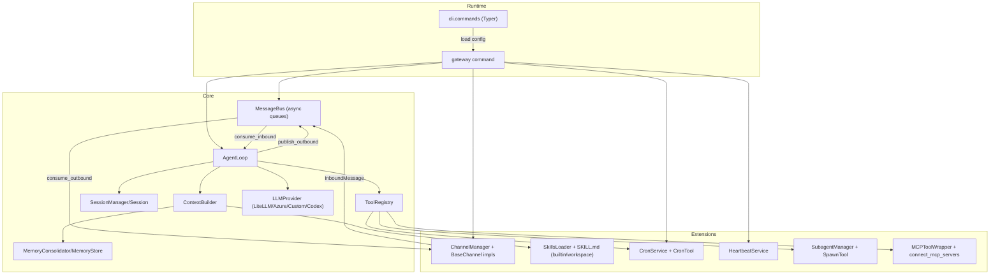
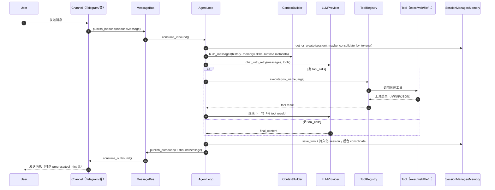
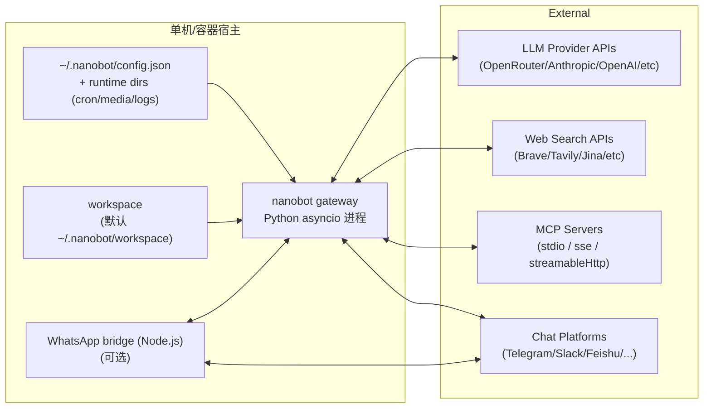

# HKUDS/nanobot 源码深度研究报告

## 执行摘要

- nanobot 的核心是一套以 **消息总线（MessageBus）** 解耦“多聊天渠道”与“单一 AgentLoop”的个人 AI 助手框架：渠道把消息推入 inbound 队列，AgentLoop 调用 LLM（含工具调用），再把结果推回 outbound 队列交给渠道发送。citeturn14view0turn12view0turn16view1  
- 项目把“可扩展能力”主要放在三条主线上：**频道插件（Python entry_points）**、**技能（SKILL.md + 渐进式加载）**、以及 **MCP 服务器工具桥接**（把外部 MCP 工具包装成本地 Tool）。citeturn8view0turn16view2turn19view4turn14view9turn30view0  
- 在工程实践上，项目以 Python 3.11+ 为基线，提供覆盖多渠道/多 provider 的测试集，并用 GitHub Actions 在 3.11–3.13 跑 pytest；整体偏“实用主义”，但仍处于 Alpha 阶段，且默认架构采用全局处理锁，吞吐与并发模型需要你在做更强 AI agent 集成时重点改造。citeturn8view2turn10view0turn12view0  
- 如果你的目标是“做更通用、更可嵌入的 AI agent”，最值得复用/改造的核心资产是：**ToolRegistry + 工具安全边界**、**会话/记忆分层与 token 驱动的压缩归档**、**多 provider 统一接口（LiteLLM + 直连 provider）**，其次才是具体聊天渠道适配。citeturn14view8turn22view0turn22view1turn21view1turn28view0turn13view1  

## 项目定位与整体形态

nanobot 在 README 中将自己描述为“Ultra-Lightweight OpenClaw”，并提供一套“个人 AI 助手框架”的使用方式：通过 `nanobot onboard` 初始化本地配置与 workspace；通过 `nanobot agent`（CLI 交互）或 `nanobot gateway`（常驻进程）运行；并通过开启不同 channels 将消息接入各类聊天应用。citeturn29search3turn13view1turn4view7  

从源码角度看，项目的“整体形态”可以抽象为四个层次：

1) **运行时外壳（CLI / Gateway）**：Typer 驱动的命令入口负责加载配置、构造 provider、启动 AgentLoop、ChannelManager、CronService、HeartbeatService，并将它们用 asyncio.gather 拉起。citeturn13view1turn14view6turn14view7turn16view1  

2) **对话与状态层（Session + Memory）**：Session 以 append-only 的消息列表持久化，Memory 用 `MEMORY.md`（长记忆，进入 prompt）+ `HISTORY.md`（历史归档，不进 prompt，供检索）做二层记忆；并通过 token 估算触发“归档压缩”。citeturn14view2turn21view0turn21view1turn20view3  

3) **智能执行层（AgentLoop + ToolRegistry）**：AgentLoop 负责把“用户消息 + 历史 + 记忆 + 技能摘要”组合成 messages，调用 LLM provider 获取工具调用或最终回答，并执行工具后循环迭代。citeturn12view0turn20view1turn14view8turn14view3  

4) **接入与扩展层（Channels / Skills / MCP / Subagents）**：Channels 负责接入“聊天平台消息”，Skills 让 agent 学会使用某些 CLI/流程，MCP 把外部工具以统一 Tool 形式挂上来；Subagent 提供后台任务（spawn）以避免主循环被长任务拖死。citeturn16view0turn19view4turn14view9turn15view2turn22view4  

（注：本文仅就仓库源码与仓库内文档可直接确认的信息进行分析；若某些平台细节/协议在仓库中未出现，将标注“未指定”。）

## 软件架构设计

nanobot 在 README 给出了模块级目录结构（agent / channels / bus / cron / heartbeat / providers / session / config / cli 等），这基本对应其逻辑分层。citeturn5view4turn6view1  

### 模块划分与组件职责

下表是基于目录结构 + 关键入口文件 + 关键类的“职责拆解”（偏用于你做二次开发时的读取路径）：

| 模块/目录 | 关键对象/入口 | 核心职责 | 关键数据/状态 |
|---|---|---|---|
| `nanobot/cli` | `nanobot.cli.commands:app` | CLI 命令、onboard、gateway 启动、provider 选择、WhatsApp bridge 管理等 | 配置路径、workspace 路径、命令参数 citeturn13view1turn25view0turn25view1 |
| `nanobot/config` | `Config`（Pydantic Settings） | 配置 schema、provider 自动匹配、工具/网关/频道配置聚合 | `~/.nanobot/config.json`（默认），支持 env 前缀 `NANOBOT_` citeturn25view0turn25view1turn26view1 |
| `nanobot/bus` | `MessageBus` + `InboundMessage/OutboundMessage` | 以 asyncio.Queue 解耦 channels 与 agent；inbound/outbound 双队列 | inbound/outbound 队列长度、消息元数据（reply/thread/progress 等） citeturn14view0turn14view1 |
| `nanobot/channels` | `BaseChannel` + `ChannelManager` | 各聊天平台接入、ACL（allowFrom）、媒体下载/发送、outbound 分发 | channel 内部连接状态、线程/消息 id 映射、媒体缓存等 citeturn16view0turn16view1turn16view3 |
| `nanobot/agent` | `AgentLoop` + `ContextBuilder` | 收 inbound、拼 prompt、调用 LLM、执行 tool calls、保存 session、推 outbound | 全局处理锁、最大迭代次数、tool 结果截断、MCP 连接状态 citeturn12view0turn20view1turn11view0 |
| `nanobot/agent/tools` | `ToolRegistry` + tool 实现 | 工具 schema、参数校验、执行与错误提示；内置 exec/web/file/message/spawn/cron/mcp 等 | 工具注册表、执行超时、访问边界与 SSRF 防护 citeturn14view8turn22view0turn22view2turn23view0 |
| `nanobot/session` | `SessionManager` / `Session` | 会话持久化与历史片段裁剪（对齐 tool-call 合法边界） | append-only messages、`last_consolidated` 偏移 citeturn14view2turn12view0 |
| `nanobot/agent/memory` | `MemoryStore` / `MemoryConsolidator` | 将旧对话归档到 MEMORY.md/HISTORY.md；失败回退 raw-archive；token 驱动压缩策略 | `memory/MEMORY.md`、`memory/HISTORY.md`、失败计数、锁 citeturn21view0turn21view1 |
| `nanobot/cron` | `CronService` + `CronTool` | 定时/循环任务（every/at/cron expr），存储 jobs.json，触发时回调执行 agent | `cron/jobs.json`、next_run_ms、job 状态 citeturn14view6turn22view5turn13view1 |
| `nanobot/heartbeat` | `HeartbeatService` | 周期唤醒：读取 HEARTBEAT.md，用“虚拟工具调用”判定 run/skip，必要时执行并推送结果 | `workspace/HEARTBEAT.md`、interval、Phase1/Phase2 citeturn5view1turn14view7turn13view1 |
| `nanobot/providers` | `LLMProvider` + `LiteLLMProvider` 等 | 多 provider 统一 chat() 接口、重试、工具调用解析、模型前缀/网关推断 | api_key/api_base、env 注入、usage、reasoning_content 等 citeturn14view3turn28view0turn28view2turn28view3 |
| `nanobot/skills` | 各 skill 的 `SKILL.md` | 用“可读文档”教 agent 使用外部 CLI/工作流（如 gh、wttr、tmux 等）；支持 workspace 覆盖与依赖检测 | skills 目录、前置依赖（bins/env）、always skill citeturn17view0turn19view4turn18view7 |
| `bridge`（仓库根） | Node.js bridge | WhatsApp 相关桥接（构建与运行由 CLI/Docker 负责） | `~/.nanobot/bridge` 与 `~/.nanobot/whatsapp-auth` citeturn13view1turn8view4turn8view5 |

### 组件关系与依赖关系图

该图直接对应：MessageBus 的双队列结构、AgentLoop 对 Context/Session/Tools/Provider 的聚合、ChannelManager 的 outbound 分发、以及 MCP/Skills/Subagent/Cron/Heartbeat 的扩展点。citeturn14view0turn12view0turn16view1turn14view9turn19view4turn14view7turn15view2  

### 调用流程与数据流

关键“数据流”要点（对你改造 AI agent 很重要）：

- **输入/输出消息载体**：InboundMessage/OutboundMessage 都允许携带 `metadata` 与 `media` 列表，使“线程/回复上下文/流式进度/附件”这些渠道差异被收敛到一套通用结构。citeturn14view1turn16view1turn12view0  
- **上下文构建策略**：ContextBuilder 把 runtime metadata（时间、channel、chat_id）标记为“untrusted”，并把 workspace 下的 bootstrap files（AGENTS.md/SOUL.md/USER.md/TOOLS.md）、Memory、Always Skills 与 Skills Summary 组合为 system prompt，再将 runtime+用户内容合并成单一 user message（避免部分 provider 拒绝 consecutive same-role）。citeturn20view0turn20view1turn20view3  
- **工具循环与安全边界**：AgentLoop 默认注册 read/write/edit/list + exec + web_search/web_fetch + message + spawn + cron（可选）并把 MCP tools 懒加载接入；工具结果会被截断（16k chars）避免“工具输出把 prompt 撑爆”。citeturn11view0turn12view0turn14view8  

### 部署拓扑

nanobot 的“标准部署”集中在 `nanobot gateway`：一个进程内同时跑 AgentLoop、ChannelManager、CronService、HeartbeatService（和可选 MCP client）；WhatsApp 需要额外 Node.js bridge（本地或容器内构建/运行）。citeturn13view1turn8view4turn8view3turn8view5  

其中，Docker Compose 默认暴露 gateway 端口 18790，并把宿主机 `~/.nanobot` 挂载到容器内 `/root/.nanobot`，确保配置与 workspace 持久化。citeturn8view3turn4view7  

### 可扩展性与可维护性评估

可扩展性（优势）：

- **频道插件化**：频道 discovery 同时支持 built-in（pkgutil 扫描）与外部插件（Python entry points `nanobot.channels`），并在 onboard 时自动注入 default config；这使“加新渠道”可以在独立包内迭代，而不一定要改主仓库。citeturn16view2turn8view0turn13view1turn30view0  
- **provider/模型扩展**：ProviderSpec 注册表驱动模型前缀、env 注入、网关/本地部署识别与参数覆盖；LiteLLMProvider 通过 registry 做统一路由，避免 provider if-else 泥球。citeturn14view4turn28view0turn26view1  
- **工具外接能力**：MCP client 能把 stdio/SSE/HTTP 的 MCP server tools 包装成本地 Tool，并提供超时/取消的兜底；对于 AI agent 来说，相当于“外部工具生态适配器”。citeturn14view9turn30view0  

可维护性（待关注点）：

- **全局处理锁的吞吐上限**：AgentLoop `_dispatch()` 在全局 `_processing_lock` 下处理消息，天然更偏“单用户/低并发”模型；当你把它做成多用户 Agent 服务时，会遇到吞吐瓶颈与 tail latency 放大。citeturn12view0  
- **渠道实现复杂度差异**：例如 Telegram channel 文件较长，含大量格式兼容与媒体处理逻辑，未来维护成本聚集在“多平台差异与边缘 case”。citeturn16view3turn30view0  
- **状态分散与持久化碎片化**：Session（消息 JSONL/数组）、Memory（MEMORY.md/HISTORY.md）、Cron（jobs.json）、WhatsApp auth（whatsapp-auth 目录）都落在本地文件系统；单机友好，但要扩展到多实例/云原生会带来一致性与迁移成本。citeturn14view2turn21view0turn14view6turn8view5  

## 功能点盘点与 AI agent 集成优先级

本节以“面向你做 AI agent 集成/复用”为导向，把 nanobot 的功能拆成：**核心（Core）/次要（Secondary）/可选（Optional）**，并给出“集成优先级建议”（P0/P1/P2）。功能点尽量以仓库内 README、源码与 release notes 能确认的为准；无法确认则标注“未指定”。citeturn5view4turn12view0turn30view0  

### 功能全景表

| 功能域 | 子功能 | 级别 | 典型使用场景 | AI agent 集成优先级 | 关键资料指向 |
|---|---|---|---|---|---|
| Agent 核心循环 | LLM ↔ tool execution 迭代（max_iterations） | Core | 需要工具调用（web/file/shell）完成任务的 Agent | P0 | AgentLoop 设计描述与默认工具注册 citeturn11view0turn12view0 |
| 工具体系 | 工具注册、schema、参数校验、统一执行与错误提示 | Core | 你要做插件化工具/能力扩展的基础 | P0 | ToolRegistry 及 execute() 错误提示策略 citeturn14view8 |
| 文件系统工具 | read/write/edit/list + 路径约束 | Core | Agent 读写 workspace、生成代码/文档、修改配置等 | P0 | 文件工具与路径解析/上限策略 citeturn22view1 |
| Shell 执行 | `exec` + deny patterns + timeout + restrict-to-workdir | Core（高风险） | 自动化脚本、调用 CLI（git/gh/curl 等）、快速系统集成 | P0（需策略增强） | ExecTool 安全守卫/超时/输出截断 citeturn22view0turn8view5 |
| Web 能力 | `web_search` 多 provider + key 缺失 fallback | Core | Agent 做检索增强（RAG-like）、信息验证 | P0 | WebSearchTool provider 选择与 fallback；release notes 强调可配置搜索 provider citeturn22view2turn30view0turn29search3 |
| Web 获取 | `web_fetch`（Jina Reader + readability-lxml）+ SSRF 防护 | Core | 抓网页正文、抽取摘要/资料，用于 agent 读文档 | P0 | _validate_url_safe/redirect 验证与 “untrusted banner” citeturn22view2turn23view0 |
| 多 provider | LiteLLMProvider（统一接入多家）、以及直连 provider（Azure/Custom/Codex） | Core | 需要“一套 agent 同时适配多模型/多网关” | P0 | pyproject 依赖与 provider 代码 citeturn8view2turn28view0turn28view2turn28view3 |
| 会话管理 | Session 持久化、历史裁剪（对齐 tool-call 边界） | Core | 多轮对话、线程隔离、避免 tool-call 断裂导致 provider 报错 | P0 | Session.get_history 的合法边界处理 citeturn14view2 |
| 记忆分层 | MEMORY.md + HISTORY.md；LLM 工具调用 `save_memory`；失败 raw-archive | Core | 长期偏好/项目上下文的沉淀；避免上下文膨胀 | P0 | MemoryStore/MemoryConsolidator 策略与回退 citeturn21view0turn21view1 |
| Token 驱动压缩 | prompt 估算超窗后分段归档，目标压到“半窗” | Core | 长对话下稳定运行；降低 provider 400/超限概率 | P0 | maybe_consolidate_by_tokens 与 boundary 选择策略 citeturn21view1turn12view0 |
| 后台子代理 | `spawn` → SubagentManager 独立工具集 + 结果回灌主 agent | Secondary | 把复杂/耗时任务后台跑，主会话保持响应；并行探索 | P1 | spawn/subagent 与 cancel_by_session citeturn22view4turn15view2turn15view1 |
| 频道消息发送工具 | `message` tool（让 agent 主动发消息到当前 chat） | Secondary | 主动通知（如 cron 触发后通知）、多渠道路由 | P1 | MessageTool 与 turn 发送抑制逻辑 citeturn22view3turn12view0 |
| Cron 定时任务 | `cron` tool：add/list/remove；CronService jobs.json | Secondary | “提醒我/周期任务/运行 agent 任务后回传” | P1 | cron skill 示例、CronService、gateway on_cron_job 回调 citeturn18view6turn14view6turn13view1 |
| Heartbeat 周期任务 | 30min 唤醒 + 读取 HEARTBEAT.md；Phase1 虚拟工具判定 | Secondary | 类“待办清单”驱动的周期主动任务（天气/邮箱等） | P1 | README Heartbeat 描述与 HeartbeatService 设计 citeturn5view1turn14view7 |
| Skills 体系 | builtin/workspace skills；依赖检查；always skills；技能摘要 | Secondary | 为 agent 注入“可操作的 SOP/工具使用指南” | P1 | SkillsLoader、skills README、memory skill always:true citeturn19view4turn17view0turn18view7 |
| Skills：GitHub | `gh` CLI 工作流 | Optional | 你做“开发者助手”场景（issue/PR/CI） | P2 | github skill 内容 citeturn18view0 |
| Skills：Weather | `wttr.in` / Open-Meteo | Optional | 日常天气查询、heartbeat 待办 | P2 | weather skill 内容 citeturn18view1 |
| Skills：Summarize | `summarize` CLI（URL/文件/YouTube） | Optional | 链接摘要/视频转写/材料提取 | P2 | summarize skill 内容 citeturn18view2 |
| Skills：tmux | 控制 tmux 会话实现交互式 CLI 自动化 | Optional（高阶） | 并行跑 coding agents；需要 TTY 的工具链 | P2 | tmux skill 内容 citeturn18view3 |
| Skills：ClawHub | npx 搜索/安装 skills | Optional | 运行时扩展 skill 生态 | P2 | clawhub skill 内容 citeturn18view4 |
| Channels | 多聊天平台接入（内置 + 插件） | Secondary | 把 agent 部署到 Telegram/Slack/企业 IM 等 | 视你产品形态（P0–P2） | BaseChannel/ChannelManager + 插件指南；release notes 指出 channel layer 已成熟并引入插件架构 citeturn16view0turn16view1turn8view0turn30view0 |
| 渠道 ACL | `allowFrom` 名单、空列表默认 deny；并建议限制访问 | Core（安全） | 生产部署必须要做访问控制 | P0 | BaseChannel.is_allowed + SECURITY.md 的版本差异说明 citeturn16view0turn8view5 |
| 语音转写 | Groq Whisper 转写（供 channel 调用） | Optional | 语音消息 → 文本；例如 Feishu/Telegram voice | P2 | BaseChannel.transcribe_audio + transcription provider citeturn16view0turn28view4 |
| WhatsApp Bridge | Node 20 构建 bridge；channels login 扫码；bridgeToken 共享密钥 | Optional（维护成本高） | WhatsApp 接入 | P2 | Dockerfile/CLI/Security 对 bridge 的说明 citeturn8view4turn13view1turn8view5 |
| 配置多实例 | `--config` + workspace 隔离；cron/media/state 从 config dir 派生 | Secondary | 同一台机器跑多个 bot（不同平台/环境） | P1 | README 多实例说明 citeturn5view0turn4view7turn25view1 |

### 交互流程示例

为了便于你“把它接到更大的 AI agent 系统里”，这里给三个典型流程的“最小交互”：

- **CLI 交互（本地单会话）**：用户在终端输入 → MessageBus → AgentLoop → OutboundMessage 返回到 CLI 渲染；支持 progress line（可配置屏蔽 tool hints/progress）。citeturn13view1turn12view0turn16view1  
- **Gateway 常驻（聊天平台代理）**：Channel.start() 监听消息并 `_handle_message()` 入队 → AgentLoop 处理 → ChannelManager dispatcher 出队并发送；并发上 Channel 与 Agent 分离，但 AgentLoop 在全局锁下串行处理。citeturn16view0turn16view1turn12view0  
- **后台任务（spawn）**：主 agent 调用 spawn → SubagentManager 单独跑简化版工具循环（最多 15 轮）→ 把结果包装成 system InboundMessage 回灌主 agent，由主 agent 总结并发回用户。citeturn22view4turn15view2turn12view0  

## 技术栈与依赖生态

### 语言、构建与许可证

- **主要语言**：Python；要求 `>=3.11`，并在 CI 中覆盖 `3.11/3.12/3.13`。citeturn8view2turn10view0  
- **前端/桥接**：WhatsApp bridge 需要 Node.js；Dockerfile 显式安装 Node.js 20，并在容器构建阶段执行 `npm install`/`npm run build`。citeturn8view4turn13view1  
- **许可协议**：MIT（pyproject 声明）。citeturn8view2  
- **版本状态**：项目在 classifiers 中标注 `Development Status :: 3 - Alpha`，当前包版本为 `0.1.4.post5`。citeturn8view2turn30view0  

### 关键依赖与外部服务清单

下表是“对 AI agent 能力影响最大”的依赖与外部服务（按功能域归类；版本范围尽量取 pyproject 里的约束，仓库未指定则写“未指定”）：

| 域 | 依赖/服务 | 用途 | 版本/约束 | 稳定性与替代方案（简述） |
|---|---|---|---|---|
| CLI 框架 | Typer + prompt_toolkit + Rich | 命令行交互、输入编辑、渲染 | `typer>=0.20,<1` 等 citeturn8view2turn13view1 | 生态成熟；替代：Click（但 Typer 更贴近现代 typing） |
| 配置 | Pydantic v2 + pydantic-settings | schema、camelCase/ snake_case 兼容、env 注入 | `pydantic>=2.12,<3` citeturn8view2turn14view5turn26view1 | 成熟；替代：dataclasses + marshmallow/attrs（工程成本更高） |
| 多模型路由 | LiteLLM | 统一 chat completion 调用多个 provider | `litellm>=1.82.1,<2` citeturn8view2turn28view0 | 生态活跃但 API 变动可能；替代：自建 provider adapter 层（更可控但要维护多个 provider 协议） |
| OpenAI 兼容 SDK | `openai` | CustomProvider 直连 OpenAI-compatible endpoint | `openai>=2.8.0` citeturn8view2turn28view1 | 成熟；替代：httpx 直连（需自维护协议细节） |
| HTTP 客户端 | httpx | web_fetch / providers / OAuth 流等 | `httpx>=0.28,<1` citeturn8view2turn22view2turn28view2 | 成熟；替代：aiohttp（但本项目多处已有 httpx） |
| Web Search | Brave Search / Tavily / DuckDuckGo / SearXNG / Jina | `web_search` provider 可配置与 fallback | provider 名在 config.schema citeturn14view5turn22view2turn30view0 | 取决于你是否能提供 key 与可用性；替代：自建搜索聚合器或本地索引 |
| Web Extract | Jina Reader + readability-lxml | `web_fetch` 抽取页面正文 | `readability-lxml>=0.8.4,<1` citeturn8view2turn22view2 | 现实可用；替代：trafilatura / newspaper3k（但要重新做安全/质量兜底） |
| 计划任务 | croniter | cron expr 解析 | `croniter>=6,<7` citeturn8view2turn14view6 | 成熟；替代：APScheduler（更重） |
| MCP | `mcp` + httpx | 连接 MCP servers，注册外部工具 | `mcp>=1.26,<2` citeturn8view2turn14view9turn11view0 | 迭代中；替代：自定义 RPC/插件协议（但丢失生态） |
| 日志 | loguru | 统一日志输出 | `loguru>=0.7.3,<1` citeturn8view2turn12view0 | 易用；替代：标准库 logging + structlog（可做结构化与兼容） |
| 消息渠道 SDK | python-telegram-bot / slack-sdk / 等 | 各渠道接入 | pyproject 依赖列表 citeturn8view2turn16view3 | 多 SDK 并存会带来版本兼容风险；替代：将渠道移出主包（插件化） |

### 社区活跃度与稳定性信号

- 仓库在 GitHub 页面显示较高的 Star/Fork 数，并有数量可观的 Issues/PR；同时 release notes 里也强调“社区贡献者增长”和“57 PRs merged / 29 new contributors”。这说明项目处于快速演进期，接口与行为仍可能发生变化。citeturn6view1turn30view0  
- 贡献指南明确采用 `main`（稳定）+ `nightly`（实验）的双分支策略，并以 cherry-pick 方式把稳定特性从 nightly 引入 main，约一周节奏（“未指定”是否严格执行）。citeturn8view6turn30view0  

## 代码质量与工程实践评估

### 目录结构与可读性

- 项目把“核心 agent 逻辑、渠道、工具、provider、会话/记忆、配置、CLI”按照职责拆分，属于典型的可维护布局；README 也直接给了结构说明，对新读者友好。citeturn5view4turn13view1turn12view0  
- 代码风格上，仓库使用 Ruff（lint/format）并把行宽定为 100；pytest 以 asyncio_mode=auto 跑异步测试。citeturn8view2turn8view6  

### 测试与 CI/CD

- `tests/` 目录覆盖面广（channel、provider、cron、heartbeat、filesystem、web_fetch、安全等均有单测文件）。citeturn7view2  
- GitHub Actions 工作流会在 push/PR（main/nightly）时跑 pytest，并覆盖 Python 3.11–3.13；会安装 `libolm-dev` 等系统依赖。当前工作流没有显式跑 coverage，也没有静态类型检查（mypy/pyright）步骤。citeturn10view0turn8view2  

### 文档与配置管理

- README 覆盖了 CLI、Docker、systemd 等运维方式；并明确 `nanobot agent` 不会附着到既有 gateway 进程（两者是独立运行时），这对你做服务化时的进程模型很关键。citeturn5view0turn4view7  
- Channel 插件指南在仓库内给出了“从 subclass → entry_points → 安装配置”的完整最小例子，且解释了 gateway 启动时的扫描顺序与启用条件。citeturn8view0turn16view2  
- config loader 提供了最小迁移逻辑（将旧字段挪到新位置），但整体配置迁移策略相对轻量；复杂迁移（如数据目录结构、sessions/memory 的格式升级）在仓库中“未指定”。citeturn25view0turn25view1  

### 安全隐患与防护现状

仓库内 SECURITY.md 把风险点和最佳实践写得很直白，尤其强调：API keys 不要提交、配置权限（0600）、allowFrom 白名单、不要以 root 运行、`exec` 工具风险、日志敏感信息、依赖审计等。citeturn8view5turn22view0  

从源码看，现有防护主要落在：

- **访问控制**：BaseChannel `allow_from` 为空则 deny all；ChannelManager 甚至会在 enabled channel 的 allowFrom 为空时报错退出，强制你显式配置。citeturn16view0turn16view1turn8view5  
- **命令执行守卫**：ExecTool 用 deny pattern 阻断常见 destructive command，并在 restrict_to_workspace 打开时做 path traversal/绝对路径约束；但 SECURITY.md 也承认这只是“limited command filtering”。citeturn22view0turn8view5  
- **SSRF 防护**：web_fetch 使用 hostname→IP 解析并阻断内网/metadata/loopback 段；并在 redirect 后再次校验 resolved URL。citeturn23view0turn22view2  
- **工具执行鲁棒性**：ToolRegistry 在参数校验失败或工具返回 Error 时追加提示，引导 LLM“换种方式重试”；AgentLoop 对工具结果截断、对 provider error response 不写入 session（避免“400 错误循环”污染上下文）也是典型工程化护栏。citeturn14view8turn12view0turn30view0  

你做更“通用 AI agent”时应补齐的安全能力（仓库明确列出“已知限制”）包括：**应用层 rate limiting、审计日志、会话过期与更严的沙箱策略**。citeturn8view5  

### 性能瓶颈点与可观测性建议

性能/扩展瓶颈（基于源码可确认的实现）：

- **串行化处理**：全局 `_processing_lock` 使得即便多渠道同时输入，也倾向按消息逐个处理；对“个人助理”是合理 trade-off，但对“服务化多租户 agent”是硬瓶颈。citeturn12view0  
- **上下文膨胀**：虽然有 token 驱动的 consolidation，但 prompt 构建仍会注入 bootstrap files、Memory、Skills summary 等内容；当你添加更多技能/插件时，需要更精细的“按需加载”与“上下文预算”机制。citeturn20view0turn19view4turn21view1  

可观测性（项目已有与建议）：

- release notes 指出引入了 LangSmith 会话跟踪（并在 pyproject 中作为可选依赖），这给你做运行时 tracing 打了一个口子。citeturn30view0turn8view2  
- 建议你在二次开发时补充：**结构化日志（JSON）+ correlation id（session_key、message_id、tool_call id）+ 基础 metrics（队列长度、LLM RTT、tool RTT、失败率）+ 分布式 tracing（OpenTelemetry）**。现有 MessageBus/OutboundMessage.metadata 已经提供了载体，你只需把它贯穿到 logger 与 exporter。citeturn14view0turn14view1turn22view3  

## 面向 AI agent 的改造方案与里程碑

本节假设你的目标是：**把 nanobot 从“个人助理 CLI/网关”演进成“可嵌入、可编排、可插件化的 AI agent 底座”**。以下建议以“尽量复用现有资产”为前提，并明确哪些改动是 structural、哪些是 incremental。

### 接口设计：API / 事件 / 插件

现状：nanobot 的“公共接口”主要是 CLI 命令；内部通过 MessageBus + ChannelManager 解耦，但并没有提供稳定的 Python SDK API（例如 `NanobotRuntime`）或 HTTP API（SSE/WebSocket）。citeturn13view1turn14view0turn16view1  

建议的接口层设计（兼容现架构）：

1) **嵌入式 SDK（Python API）**  
   抽一个 `NanobotRuntime`（或 `AgentRuntime`）类，把当前 gateway 命令里“构造组件并 gather”的逻辑迁到可 import 的模块：  
   - `runtime = NanobotRuntime.from_config(config_path, workspace=...)`  
   - `await runtime.start()` / `await runtime.stop()`  
   - `await runtime.handle_message(channel, chat_id, content, media, metadata) -> response/stream`  
   好处：你可以在更大的 AI agent 系统内直接引入，不必 shell out 到 CLI。依据：当前 AgentLoop、MessageBus、ChannelManager 都是纯 Python 组件，组合成本低。citeturn13view1turn12view0turn14view0turn16view1  

2) **事件总线扩展**  
   现有 bus 只有 inbound/outbound 两类消息；建议把关键内部事件也标准化（例如 `ModelCallStarted/Finished`、`ToolCallStarted/Finished`、`MemoryConsolidation`、`CronTriggered`）。可以继续用 asyncio.Queue，但将事件类型泛化并统一序列化，以便接入 metrics/tracing。citeturn14view0turn21view1turn14view6  

3) **插件层扩展到 Tools/Providers**  
   nanobot 已经把 channels 插件化（entry_points `nanobot.channels`），你可以沿同一模式新增：  
   - `nanobot.tools`：第三方工具包（类似 LangChain tools 生态，但更轻）  
   - `nanobot.providers`：第三方 provider（或网关适配）  
   这样做的原因来自 release notes 的路线：项目已经明确要向“更 modular、更 plugin-oriented”演进，并以 channel layer 作为试验田。citeturn16view2turn30view0turn14view8  

### 状态管理：从“本地文件”到“可替换存储”

现状：Session、Memory、Cron 都落本地文件（workspace 与 config dir），适合单机；但当你做多实例/容器编排时会遭遇共享/迁移难题。citeturn14view2turn21view0turn14view6turn25view1  

改造建议：

- **抽象存储接口**：为 SessionStore、MemoryStore、CronStore 分别定义接口（当前 CronService 已有 `CronStore` 类型概念），默认实现仍用文件，但允许替换为 SQLite（单机更稳）或 Postgres/Redis（多实例）。citeturn14view6turn21view1turn14view2  
- **引入版本化数据模型**：例如在 session JSONL 里写 `schema_version`，对未来升级（工具调用格式变化、metadata 增补）更友好。目前“配置迁移”相对轻量，而数据迁移策略“未指定”。citeturn25view0turn14view2  

### 并发与容错：从“全局锁”到“按 session 隔离的并行”

现状：AgentLoop 用 `_processing_lock` 串行化所有 `_dispatch`；同时用 `_active_tasks` 追踪每个 session 的任务便于 `/stop` 取消；Subagent 也可按 session 取消。citeturn12view0turn15view1  

建议方案（按风险从低到高）：

- **低风险：把“锁粒度”从全局改为 per-session**  
  用 `dict[session_key, asyncio.Lock]` 替换全局 `_processing_lock`：  
  - 同一 session 仍串行（避免上下文竞态）  
  - 不同 session 并行（提升吞吐）  
  与 MemoryConsolidator 的“per session consolidation lock”保持一致。citeturn12view0turn21view1  

- **中风险：引入“消息去重/幂等”**  
  多渠道可能会重复投递/重试（例如 webhook/长连接异常），建议用 `metadata.message_id`（已有）做幂等键，避免重复执行工具（尤其是 exec/写文件）。citeturn14view1turn16view3turn22view3  

- **高风险：把 MessageBus 升级为可持久化队列**  
  对服务化场景，考虑用 Redis Streams / NATS / RabbitMQ 做 message bus；但你需要重写 ChannelManager 的 dispatcher 与 AgentLoop 的 consume loop，并解决“进度流（_progress）”的有序性。当前实现更适合单进程。citeturn14view0turn16view1turn12view0  

### 模型集成点：把“provider 适配”升级为“能力/约束协商”

现状：provider 适配已经相当完善：LiteLLMProvider 负责 tool_calls 解析合并、cache_control 注入、模型前缀规范化；AzureOpenAIProvider 与 CodexProvider 走直连路径；这为你集成更多模型打好了基础。citeturn28view0turn28view2turn28view3  

建议进一步把“模型约束”显式化：

- **能力矩阵**：把“是否支持 image input、是否支持 forced tool_choice、是否支持 cache_control、是否支持 reasoning_effort”等抽成 provider capabilities；目前部分逻辑以“字符串规则/异常检测”实现（例如内存 consolidation 对 tool_choice 不支持的回退）。citeturn21view1turn28view0  
- **一致的错误分类与重试策略**：LLMProvider 已有 transient error markers 与 retry delays；你可以把工具层与 channel 层的错误也纳入统一分类（例如 network/timeout/provider_quota/validation），便于自动退避与用户提示。citeturn14view3turn14view8turn22view2  

### 数据隐私与日志策略

仓库明确提醒“Logs may contain sensitive information”“API keys are in plain text config”“No Rate Limiting”等，这意味着当你要把它做成对外服务时，必须提升隐私与合规能力。citeturn8view5  

建议的最小改造集合：

- **密钥管理**：引入 OS keyring（或 KMS），并在 config.json 内只保留 key reference；至少对日志进行 API key 与敏感字段脱敏。citeturn8view5turn25view0  
- **日志分级与留存**：把“用户内容/模型输出/工具输出”拆成不同日志通道，可按策略开启；并对 `exec` 与 `write_file/edit_file` 记录审计事件（谁、何时、对哪个路径、写了多少字节）。当前只是一套 loguru 日志。citeturn22view0turn22view1turn8view5  
- **最小化外发**：对于 `web_fetch` 与 `web_search`，将 proxy/allowlist/denylist 纳入策略配置；仓库已有 proxy 字段与 SSRF 防护，你只需做更上层的 policy 管控。citeturn14view5turn22view2turn23view0  

### 示例改造步骤与里程碑计划

下面是一个“独立开发者可落地”的里程碑计划（以人天估算；假设你熟悉 Python/asyncio，并且会做基础 DevOps）。如你有更明确目标（比如一定要多租户 SaaS、或一定要本地离线），可再细化。

| 里程碑 | 目标交付 | 关键改动点（与仓库对应） | 估算工时 | 优先级 |
|---|---|---|---:|---|
| M1：可嵌入运行时 | 提供 `NanobotRuntime` Python API（可在你项目里 import 运行） | 抽离 gateway 组合逻辑；封装 AgentLoop/Bus/ChannelManager 启停；统一 handle_message 接口 | 2–4 人天 | P0 |
| M2：并发升级 | 不同 session 并行、同 session 串行；保留 `/stop` 能力 | `_processing_lock` → per-session lock；改 `_active_tasks` 管理；补充幂等键（message_id） | 3–6 人天 | P0 |
| M3：可观测性与审计 | 指标/追踪/结构化日志、关键工具审计 | 在 bus/outbound metadata 注入 correlation id；接入 LangSmith 或 OTEL；exec/file/web 工具增加 audit event | 3–7 人天 | P1 |
| M4：存储抽象 | Session/Memory/Cron 可切换到 SQLite（单机）或 Postgres（多实例） | 引入 Store interface；保持现有文件实现；提供 SQLite 实现；迁移工具 | 5–12 人天 | P1 |
| M5：插件生态扩展 | tools/providers 插件化（entry_points），形成你自己的 agent 生态 | 参照 channels 插件，新增 `nanobot.tools` group；ToolRegistry 支持从 entry_points 加载 | 4–8 人天 | P2 |
| M6：安全强化（生产化） | rate limiting、沙箱、策略引擎 | 对 inbound 做速率限制；exec 进一步沙箱（容器/受限用户）；web 域名策略 | 5–15 人天 | P2 |

上述计划中，M1/M2 直接对应你“更好地做 AI agent”的底座需求：可嵌入 + 并发模型；而 M3/M4 解决从个人工具到“可靠系统”的关键差距。citeturn13view1turn12view0turn14view0turn21view1turn16view2turn30view0turn8view5  

## 风险与限制

### 技术风险

- **命令执行与数据泄露风险**：即便 ExecTool 有 deny patterns 与路径守卫，`exec` 仍然是高风险能力；SECURITY.md 也明确提示“不要在含敏感数据的系统上无审计地运行”“No Rate Limiting”“No Audit Trail”。citeturn22view0turn8view5  
- **外部内容注入风险**：web_fetch/web_search 已标注“untrusted banner”，并要求不要遵循外部内容指令；但在真实产品化时，你仍需要更强的“指令隔离/数据隔离”机制（例如工具结果只作为数据输入到特定解析器，而不是直接拼 prompt）。citeturn22view2turn20view3  
- **多 provider 兼容性持续变化**：项目用多种方式处理 provider 差异（参数 drop、tool_choice 回退、合并 choices 等），说明生态变化快、边缘兼容成本高。你做二次开发时要避免把 provider 逻辑散落在业务里，应集中在 provider 层。citeturn28view0turn21view1turn30view0  

### 架构限制

- **单进程内存队列**：MessageBus 基于 asyncio.Queue，进程重启即丢；适合个人工具但不等同“可靠消息系统”。citeturn14view0turn12view0  
- **全局串行处理**：对多渠道/多用户扩展会受限（前文已述）。citeturn12view0  
- **状态落文件系统**：单机简单，但多实例需要共享存储或复制；README 虽提供多实例配置与 Docker/systemd 示例，但并未提供分布式一致性方案（未指定）。citeturn5view0turn8view3turn4view7turn14view2  

### 迁移与二次开发难点

- **渠道层的边缘行为**：不同平台对 markdown、线程、媒体、typing 等的支持差异巨大；release notes 中大量内容都在“渠道细节打磨”，这意味着你要复用渠道代码时需要接受持续维护成本。citeturn30view0turn16view3  
- **持续演进的插件化路线**：v0.1.4.post5 明确提出“未来更 modular、更 plugin-oriented”，且以 channel layer 为试验田；这对你是机会（可以顺势扩展），也是风险（接口可能重构）。citeturn30view0turn8view6