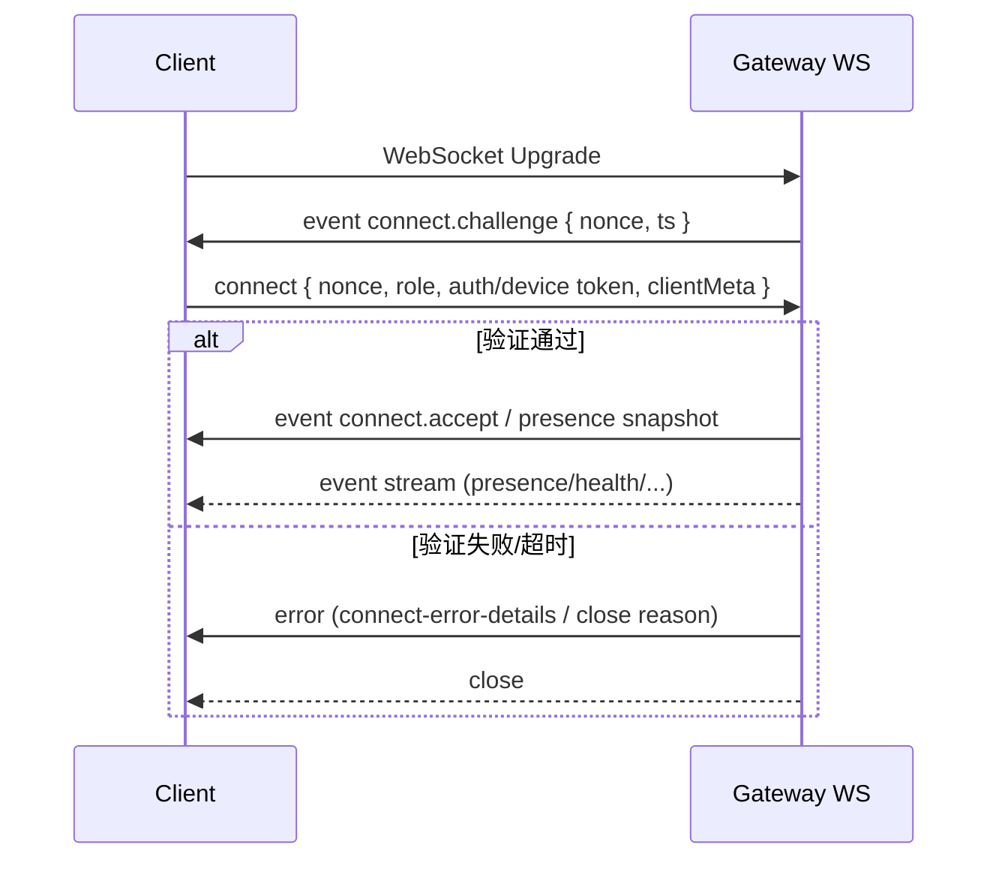

# openclaw/openclaw 仓库深度研究报告

## 执行摘要

本报告基于对 entity["company","GitHub","code hosting platform"] 上 entity["organization","openclaw","github org"] /openclaw 仓库的静态代码与文档审阅（截至 2026-03-17，Asia/Tokyo），从软件架构、功能/特性与技术栈三个角度进行系统性分析，并给出将其“平台化”为更通用 AI Agent 平台的改造建议、风险与路线图。分析基线为 main 分支最新提交 `1ffe8fde84d1c558a23d3ae985800c7bcfaf06a6`（提交信息：fix: stabilize docker test suite，时间：2026-03-17）。citeturn4view0turn3view0  

核心结论是：该仓库不是“单一聊天机器人”，而是一个“带控制平面（Gateway）+ 多客户端 + 多通道连接器 + 插件/扩展 + 远端节点（nodes）能力 + 安全配对/鉴权”的大型 AI Assistant 工程化系统。其 TypeScript/Node 主体通过 WebSocket 控制平面管理多角色客户端与节点，具备较强的安全姿态（握手挑战、鉴权与配对、限流、防洪、负载上限、日志清洗等），并且在工程质量上投入显著（lint/format、测试矩阵、Docker/E2E、依赖更新与安全扫描工作流）。citeturn20view0turn20view1turn24view3turn28view0turn10view0  

对“独立开发者构建更好的 AI agents”的价值点主要有三类：  
第一，Gateway/协议/配对/角色授权这套“控制平面骨架”可直接复用为 Agent 平台的运行时内核与远程执行基座（尤其适合多设备、自治节点、工具执行审批等场景）。citeturn18view0turn20view3turn24view1turn24view4  
第二，仓库已经出现“插件 SDK/扩展（extensions）”与“多通道/多提供商（providers）”的架构雏形，具备平台化的路径依赖与演进空间（把“个人助手产品”抽象成“通用 agent 平台”是可行的）。citeturn13view0turn11view0turn29view4turn10view0  
第三，若要升级为“更强的 AI Agent 平台”，关键差距不在“再接更多模型/通道”，而在于：统一的 agent 运行语义（Run/Step/ToolCall/State）、可观测性（端到端 trace/metrics/logs）、可评测性（回归基准、对齐测试、沙盒确定性）、权限与多租户隔离、以及面向工作流/长期任务的编排器。此部分为本报告建议重点。citeturn24view3turn28view0turn29view4turn10view0  

## 仓库版本与目录结构概览

### 分析基线与版本信息

本报告使用的代码基线：main 分支提交 `1ffe8fde84d1c558a23d3ae985800c7bcfaf06a6`。citeturn4view0turn3view0  
仓库的 npm 包版本字段在根 `package.json` 中为 `2026.3.14`（若你需要严格的“发布版”与“提交版”对齐，需要在 CI 发布流程或 tag 中进一步追踪；本次分析以提交版为准）。citeturn6view0  

运行时与包管理器要求呈现出“现代 Node 约束”：  
- `openclaw.mjs` 在启动时检查 Node.js 版本，要求 `v22.12+`，且会尝试加载构建产物 `dist/entry.(m)js`。citeturn12view0  
- `package.json` 的 engines 与包管理器字段表明：Node `>=22.16.0`，`pnpm@10.23.0`。citeturn9view3  

语言构成显示仓库是跨平台多端体系：TypeScript 为主，同时包含 Swift/Kotlin 等移动端/桌面端代码。citeturn1view0  

### 根目录结构概览

根目录包含典型的“大型 monorepo + 多端产品化”布局，关键目录包括（节选）：  
- `apps/`：多端应用（从安全政策可确认包含 macOS / iOS / Android）。citeturn29view0turn1view0  
- `src/`：主 TypeScript 运行时代码（CLI、Gateway、providers、plugins、memory 等大量模块）。citeturn13view0turn1view0  
- `extensions/`：扩展（Dockerfile 也支持在构建时选择性包含扩展依赖）。citeturn29view4turn1view0  
- `ui/`：前端 UI 相关代码。citeturn1view0  
- `docs/`：文档站点内容，包含 `zh-CN/`、`ja-JP/` 等多语言目录，以及细分主题（security/providers/plugins/gateway 等）。citeturn29view3turn1view0  
- `.github/`：GitHub Actions、CodeQL、Dependabot、CODEOWNERS 等工程化配置。citeturn27view0turn28view0  
- `Dockerfile`：多阶段构建、可选扩展依赖、基础镜像 digest 固定等生产化细节。citeturn29view4turn27view1  
- `.env.example`：本地与 daemon 部署的环境变量约定与优先级规则。citeturn29view2  

image_group{"layout":"carousel","aspect_ratio":"16:9","query":["OpenClaw AI assistant screenshot","OpenClaw webchat control UI screenshot","OpenClaw macOS app screenshot"],"num_per_query":1}

### src/ 代码域的模块地图

`src/` 目录本身就是“平台骨架图”。从目录名即可看到核心域边界：  
- 控制平面/网关：`src/gateway/`（协议、server、鉴权、控制 UI、节点策略等）。citeturn17view0turn18view0  
- Agent 与编排：`src/agents/`、`src/sessions/`、`src/routing/`、`src/context-engine/`、`src/memory/`、`src/providers/`。citeturn13view0  
- 插件与通道：`src/plugins/`、`src/plugin-sdk/`、`src/channels/`，以及与特定通道相关的 `src/whatsapp/`、`src/line/` 等。citeturn13view0turn11view0  
- 工具执行与系统层：`src/process/`、`src/daemon/`、`src/security/`、`src/secrets/`、`src/node-host/`、`src/browser/`、`src/canvas-host/`。citeturn13view0turn24view2turn24view3  
- 交互层：`src/cli/`、`src/tui/`、`src/interactive/`、`src/markdown/`、`src/media-understanding/`、`src/link-understanding/`、`src/tts/`。citeturn13view0turn10view0  

入口文件方面，`src/entry.ts` 是 CLI 入口逻辑的关键枢纽；`src/index.ts`/`src/library.ts` 提供对外导出与“legacy CLI entry”兼容。citeturn14view0turn15view0turn16view0  

## 软件架构与关键数据流

### 高层架构图

下面的 Mermaid 图是把仓库中可观测到的组件（CLI 入口、Gateway WS、控制 UI、设备配对、插件/扩展、providers、memory、browser、canvas host、多通道连接器）抽象为“组件—数据流—外部集成”的一张图。图中“外部通道/模型服务”与“本地工具/节点”均体现为可替换依赖，符合该仓库明显的“可插拔”设计趋向。citeturn13view0turn18view0turn20view0turn24view1turn10view0turn29view4  

```mermaid
flowchart TB
  %% === Clients ===
  subgraph Clients
    CLI[CLI / TUI]
    WebUI[Control UI / Webchat]
    Desktop[macOS App]
    Mobile[iOS / Android Apps]
    NodeClient[Remote Node (role=node)]
  end

  %% === Gateway / Control Plane ===
  subgraph Gateway
    HTTP[HTTP Server\n(Control UI routing, readiness, plugins-http)]
    WS[WebSocket Server\n(connect.challenge, request/response frames)]
    Auth[Auth & Pairing\n(device token, scopes, rate-limit)]
    Presence[Presence / Health Events]
    Protocol[Protocol Validation\n(PROTOCOL_VERSION, schemas, limits)]
  end

  %% === Core Runtime ===
  subgraph Runtime
    Router[Routing / Channel Dispatcher]
    AgentCore[Agent Runtime]
    Plugins[Plugins + Plugin SDK]
    Extensions[Extensions (opt-in)]
    Memory[Memory + Context Engine]
    Providers[Model Providers]
    Tools[Tooling\n(browser, exec, nodes)]
    Canvas[Canvas Host (UI capability)]
  end

  %% === External integrations ===
  subgraph External
    Msg[Messaging Platforms\n(Slack/Telegram/WhatsApp/LINE/...)]
    LLM[Model Backends\n(OpenAI/Anthropic/Bedrock/Local Llama/...)]
    Web[Web/PDF/Attachments]
  end

  CLI -->|spawn/run| WS
  WebUI -->|HTTP| HTTP
  Desktop -->|WS| WS
  Mobile -->|WS| WS
  NodeClient -->|WS| WS

  WS --> Protocol
  WS --> Auth
  WS --> Presence
  Protocol --> WS
  Auth --> WS
  Presence --> WS

  WS --> Router
  Router --> AgentCore
  AgentCore --> Memory
  AgentCore --> Providers
  AgentCore --> Tools
  Plugins --> AgentCore
  Extensions --> AgentCore

  Router --> Msg
  Providers --> LLM
  Tools --> Web
  Tools --> Canvas
```

### WebSocket 控制平面握手与安全路径

Gateway WebSocket 连接建立后，会主动向客户端发送 `connect.challenge` 事件，携带 `nonce` 与时间戳；若在握手窗口内仍未完成有效连接（`client` 仍为空），会被判定为握手超时并关闭连接。citeturn20view0turn20view1  

同时，连接生命周期里对“角色为 node 的客户端”存在明确的注销/清理逻辑（断开时从 node registry 注销、移除 remote node 信息、取消订阅等），并且会更新 presence 并广播 presence snapshot，这表明“远程节点能力”是架构的一级概念，而不是临时脚本。citeturn20view3turn19view0  

`message-handler.ts` 进一步体现握手阶段的安全控制：它显式引入了设备身份（从 public key 派生 device id、规范化 key）、设备配对/发放 token/验证 token、未授权洪泛防护（UnauthorizedFloodGuard）、以及协议版本/请求帧校验与连接参数校验（`validateConnectParams`、`validateRequestFrame`、`PROTOCOL_VERSION` 等）。citeturn24view1turn24view3turn24view4  



## 主要模块、接口与责任划分

本节以“可识别的边界 + 关键入口函数/类型”为线索，覆盖该仓库在架构上最重要的模块。

### 启动链路与 CLI 子系统

`openclaw.mjs` 是发布物的“薄启动器”：检查 Node 版本、启用 compile cache（若可用）、安装 warning filter，然后仅负责尝试导入构建产物 `dist/entry.js`/`dist/entry.mjs`。这种设计把“环境守护”与“业务入口”解耦，有利于减少打包差异与启动噪声。citeturn12view0  

`src/entry.ts` 是真正的入口编排器，体现了数个“工程化优先”的策略：  
- 通过 `isMainModule` 守护，避免被 bundler 作为依赖导入时重复运行（避免重复启动 gateway 导致端口/锁冲突）。citeturn14view0  
- 对某些 invocation 走 fast path（例如 root version），减少启动成本。citeturn14view0  
- 通过 respawn 注入 `--disable-warning=ExperimentalWarning`，并用 child-process bridge 避免父进程继续执行，从而统一警告行为与运行体验。citeturn14view0  
- 在 `secrets audit` 这种高风险/只读场景，强制设置 `OPENCLAW_AUTH_STORE_READONLY=1`，显式体现“安全模式”优先级。citeturn14view0  

`src/index.ts`/`src/library.ts` 的职责更像“SDK 门面”：把内部可复用能力（配置加载、session store、端口检查、命令执行、web channel 监控、模板渲染等）以稳定导出提供给外部或内部其它包使用，同时保留 legacy CLI entry 以兼容旧的直接执行方式。citeturn15view0turn16view0  

### Gateway 子系统：协议、服务端、鉴权、控制 UI

从目录结构与文件命名可以看出 `src/gateway/` 是“控制平面核心域”，具备典型的分层：  
- `protocol/`：协议 schema/validator、错误细节、原语校验、版本常量等。citeturn25view0turn24view3  
- `server/`：HTTP listen、TLS、WebSocket connection、readiness、plugins-http 等服务端组件。citeturn18view0  
- 领域能力文件：`auth.ts`、`device-auth.ts`、`channel-health-*`、`control-ui-*`、`node-invoke-*`、`exec-approval-manager.ts` 等，说明网关不仅“转发消息”，还内置健康监控、控制 UI 安全策略、节点命令审批、调用清洗等治理能力。citeturn17view0  

`src/gateway/server/ws-connection.ts` 体现了网关的“连接级职责”：建立连接时生成 `connId`，发送 `connect.challenge`，启动握手超时计时器，对 headers 做清洗/截断以安全日志输出，并在断开时更新 presence、对 node 角色执行注销清理。citeturn20view0turn20view1turn20view3  

`src/gateway/server/ws-connection/message-handler.ts` 则是“消息级职责”：它连接了配置加载、客户端 IP/代理头信任策略、本地直连判定、设备配对/令牌验证、角色 scopes、协议版本与请求帧校验，以及未授权洪泛防护等机制，显示出该项目将“安全与协议一致性”放在数据面第一层处理。citeturn24view1turn24view3turn24view8turn24view4  

### 插件/扩展与多通道生态

根 `package.json` 的 exports 片段显示存在 `plugin-sdk/*` 多入口（discord/slack/signal/imessage/whatsapp/line/msteams/acpx 等），其意义通常是：把“通道接入与插件开发所需类型/适配器”以较稳定的 API 形式发布，降低外部扩展与内部实现耦合。citeturn11view0  

在代码侧，`src/plugin-sdk/`、`src/plugin-sdk-internal/` 与 `src/plugins/`、`src/channels/` 并列出现，意味着项目很可能区分“对外 SDK（稳定）”与“内部实现（可变）”。目录存在本身就是一个强信号：这套系统被设计为可持续扩展，而非一次性脚本。citeturn13view0turn11view0  

Dockerfile 还提供了“构建期选择性引入扩展依赖”的开关（`OPENCLAW_EXTENSIONS`），并明确给出示例 `diagnostics-otel` 等扩展名，说明扩展并非仅源码层，而是和交付物装配流程耦合（偏平台化）。citeturn29view4turn27view1  

### Providers、Memory、Browser、TTS 等能力域

从 `src/` 目录与依赖可推断的能力域对应关系非常清晰：  
- `src/providers/` + 依赖 `@aws-sdk/client-bedrock`、`node-llama-cpp`（peer）、以及与模型/协议相关的 SDK：表示多模型后端接入。citeturn13view0turn10view0turn9view3  
- `src/memory/` + 依赖 `@lancedb/lancedb`、`sqlite-vec`：指向向量检索/本地嵌入存储能力，用于长期记忆与上下文检索。citeturn13view0turn10view0  
- `src/browser/` + `playwright-core`：指向浏览器自动化与网页工具链（抓取、执行、可视化/可复现）。citeturn13view0turn10view0  
- `src/tts/` + `node-edge-tts`：指向语音输出与语音相关能力。citeturn13view0turn10view0  
- `src/markdown/`、`src/media-understanding/`、`src/link-understanding/` + `markdown-it`、`pdfjs-dist`、`@mozilla/readability`、`sharp`：指向“内容理解管线”（文本/网页/附件解析）与媒体处理。citeturn13view0turn10view0  

## 功能点梳理与代码映射

下表将“从仓库结构与关键文件可确认的功能点”映射到代码位置与运行时行为。由于本报告以静态审阅为主，部分条目以“模块级定位”为主；对于关键安全/入口链路，给出文件行号级锚点。citeturn13view0turn14view0turn20view0turn24view3turn29view4  

| 功能/能力点 | 代码位置（文件/模块） | 运行时行为（简述） | 外部集成/依赖（若可见） |
|---|---|---|---|
| Node 版本守护与 dist 入口加载 | `openclaw.mjs`（约 L451+，L602+） | 启动时校验 Node 版本；安装 warning filter；尝试导入 `./dist/entry.(m)js`，缺失则报错 | Node compile cache；dist 构建产物 citeturn12view0 |
| CLI 入口编排、respawn、profile | `src/entry.ts`（约 L672+） | 负责 main guard、防重复启动；解析 profile；必要时 respawn 注入禁用 ExperimentalWarning；加载 `cli/run-main` 启动主程序 | child-process bridge；env 正规化 citeturn14view0 |
| WebSocket 连接握手挑战 | `src/gateway/server/ws-connection.ts`（约 L1178-L1187） | 建连后立即发送 `event connect.challenge {nonce, ts}`；进入握手状态 | WebSocket（`ws`） citeturn20view0 |
| 握手超时与连接关闭治理 | `src/gateway/server/ws-connection.ts`（约 L1348-L1366） | 若握手窗口内未成功设置 client，则标记 `handshake-timeout` 并关闭连接 | 可配置握手超时常量 citeturn20view1 |
| 日志头字段清洗与截断 | `src/gateway/server/ws-connection.ts`（sanitizeLogValue 等） | 对 host/origin/UA 等 header 做控制字符替换、空白折叠、长度上限截断，降低日志注入与可观测性噪声 | UTF-16 安全截断工具 citeturn19view0turn20view3 |
| presence/health 事件广播与 node 清理 | `src/gateway/server/ws-connection.ts`（close 回调） | 断连时更新 presence；广播 presence snapshot；若 role=node 则注销 node、移除 remote node info、取消订阅 | presence 子系统、remote node 信息管理 citeturn20view3turn19view0 |
| 设备身份/配对/Token 验证链路 | `src/gateway/server/ws-connection/message-handler.ts`（imports） | 引入 device bootstrap token 验证、公钥规范化与 deviceId 派生、pairing/ensure/verify token 等能力 | “设备即身份”与配对体系 citeturn24view1 |
| 协议版本与帧校验 | `src/gateway/server/ws-connection/message-handler.ts`（`PROTOCOL_VERSION`、`validateConnectParams`、`validateRequestFrame` 等） | 对 connect 参数/请求帧进行 schema 校验；基于协议版本做兼容；格式化校验错误 | 协议层（gateway/protocol） citeturn24view3turn25view0 |
| 负载/缓冲上限等防护常量 | `src/gateway/server/ws-connection/message-handler.ts`（`MAX_PAYLOAD_BYTES` 等） | 明确区分 pre-auth 与 auth 后的数据限制；与踢出策略配合降低 DoS 风险 | 网关常量策略集合 citeturn24view3 |
| 未授权洪泛防护 | `src/gateway/server/ws-connection/message-handler.ts`（UnauthorizedFloodGuard） | 在握手/授权阶段对异常请求进行“洪泛保护”，避免被暴力尝试拖垮 | 安全子模块 citeturn24view4 |
| 多通道/多平台接入（SDK 层门面） | `package.json` exports: `./plugin-sdk/discord|slack|signal|...`；`src/plugin-sdk/` | 通过对外 SDK 入口降低外部插件对内部实现的耦合，支持更多通道生态 | 插件 SDK 发布策略 citeturn11view0turn13view0 |
| “内容理解”工具链（网页/附件/媒体） | `src/link-understanding/`、`src/media-understanding/`、`src/markdown/`；依赖列表 | 解析网页正文、Markdown、PDF、图片等，为 agent 提供更“结构化上下文” | readability/pdfjs/sharp/markdown-it citeturn13view0turn10view0 |
| 浏览器自动化能力 | `src/browser/`；依赖 `playwright-core` | 提供可复现的网页交互/抓取能力，支撑 tool-use agent | Playwright citeturn13view0turn10view0 |
| 记忆与向量检索 | `src/memory/`；依赖 `@lancedb/lancedb`、`sqlite-vec` | 在本地或嵌入式存储中维护向量索引，支撑检索增强与长期记忆 | LanceDB、sqlite-vec citeturn13view0turn10view0 |
| 语音输出（TTS） | `src/tts/`；依赖 `node-edge-tts` | 将文本转语音（或语音通道能力的一部分） | Edge TTS 实现包 citeturn13view0turn10view0 |
| Docker 交付：多阶段、可选扩展、digest 固定 | `Dockerfile`（注释与 ARG） | 构建最小运行镜像；`OPENCLAW_EXTENSIONS` 选择性注入扩展依赖；基础镜像使用 SHA256 digest 固定以保证可复现 | Docker/Buildx/Podman；node:24-bookworm* citeturn29view4turn27view1 |
| CI/CD 工作流矩阵 | `.github/workflows/*`（ci、codeql、docker-release、install-smoke 等） | 存在完整 CI/安全扫描/镜像发布/安装烟测等工作流入口（具体 job 细节本次未能展开） | GitHub Actions；CodeQL citeturn28view0turn27view0turn28view1 |

为便于你快速抓住“控制平面握手”这类关键路径，下面附上一个极小片段（不超过必要范围）用于定位 `connect.challenge` 的协议形态：  

```js
send({
  type: "event",
  event: "connect.challenge",
  payload: { nonce: connectNonce, ts: Date.now() },
});
```

以上片段位于 `src/gateway/server/ws-connection.ts`（约 L1180-L1187）。citeturn20view0  

## 技术栈与依赖生态

### 运行时与构建系统

该仓库的核心运行时是 Node.js + TypeScript，并对 Node 版本提出较高下限要求（Node >=22.16；启动器检查 >=22.12）。包管理采用 pnpm（`pnpm@10.23.0`）。citeturn9view3turn12view0  

测试与工具链呈现“偏平台/产品级”的规模：`vitest`、覆盖率（`@vitest/coverage-v8`）、以及大量 docker/e2e/live 测试脚本入口，同时存在 deadcode/dup-check 等质量门。citeturn8view2turn7view2turn7view3turn8view1turn10view0  

### 关键第三方库、框架与工具（含版本）

以下列表以根 `package.json` 可见依赖为准（即“核心 CLI/Gateway/通用能力”的依赖视角）。移动端/桌面端（Swift/Kotlin）具体第三方库版本需在各 app 的清单文件中进一步枚举，本次由于工具调用限制尚未逐一展开。citeturn10view0turn9view3turn1view0turn29view0  

**协议/Agent 生态与模型接入**
- `@modelcontextprotocol/sdk` `1.27.1`：MCP 生态 SDK（用于工具/上下文协议协作的可能性很高）。citeturn10view0  
- `@agentclientprotocol/sdk` `0.16.1`：ACP SDK（从命名推测为 agent client protocol 的实现依赖）。citeturn10view0  
- `@aws-sdk/client-bedrock` `^3.1009.0`：接入 AWS Bedrock 模型服务。citeturn10view0  
- `node-llama-cpp` `3.16.2`（peerDependency，optional）：本地/自托管 Llama.cpp 推理的可选能力。citeturn9view3  

**Web/网关服务与网络**
- `ws` `^8.19.0`：WebSocket 服务端/客户端实现（与 gateway WS 控制平面对齐）。citeturn10view0turn20view0  
- `express` `^5.2.1`：HTTP 服务框架（用于 control UI、插件 HTTP 等）。citeturn10view0turn18view0  
- `hono` `4.12.7`：另一套 Web 框架/路由/中间件生态（通过 pnpm override 固定版本）。citeturn10view0turn9view3  
- `undici` `^7.24.1`、`https-proxy-agent` `^8.0.0`、`ipaddr.js` `^2.3.0`：网络请求、代理与 IP 解析。citeturn10view0  

**数据校验与配置**
- `zod` `^4.3.6`、`ajv` `^8.18.0`、`@sinclair/typebox` `0.34.48`：schema 校验与类型系统工具，与 gateway 协议校验链路匹配。citeturn10view0turn24view3  
- `yaml` `^2.8.2`、`json5` `^2.2.3`：配置格式支持。citeturn10view0  

**内容理解/媒体处理/浏览器工具**
- `@mozilla/readability` `^0.6.0`：网页正文抽取。citeturn10view0  
- `pdfjs-dist` `^5.5.207`：PDF 解析。citeturn10view0  
- `sharp` `^0.34.5`：图片处理。citeturn10view0turn7view1  
- `playwright-core` `1.58.2`：浏览器自动化。citeturn10view0  

**记忆与向量存储**
- `@lancedb/lancedb` `^0.26.2`：向量数据库/检索。citeturn10view0  
- `sqlite-vec` `0.1.7-alpha.2`：SQLite 向量扩展/向量索引能力。citeturn10view0turn7view1  

**消息通道/机器人生态（服务侧依赖）**
- `@slack/bolt` `^4.6.0`、`@slack/web-api` `^7.15.0`：对 entity["company","Slack","workplace messaging"] 的机器人/事件 API 支持。citeturn10view0  
- `grammy` `^1.41.1`、`@grammyjs/runner` `^2.0.3`：对 entity["organization","Telegram","messaging platform"] 机器人生态的支持。citeturn10view0  
- `@whiskeysockets/baileys` `7.0.0-rc.9`：对 entity["company","WhatsApp","messaging app"] 的接入实现（常见于非官方/逆向生态，安全与合规需额外评估）。citeturn10view0  
- `@line/bot-sdk` `^10.6.0`：对 entity["company","LINE","messaging app"] 的接入。citeturn10view0  
- `@discordjs/voice` `^0.19.1`：对 entity["company","Discord","chat platform"] 语音能力栈的一部分。citeturn10view0  
- `@larksuiteoapi/node-sdk` `^1.59.0`：对 entity["organization","Lark","collaboration suite"]（飞书/国际版）开放平台。citeturn10view0  

**工程化与质量工具**
- `vitest` `^4.1.0`、`@vitest/coverage-v8` `^4.1.0`：单测与覆盖率。citeturn8view1turn8view2  
- `oxlint` `^1.55.0`、`oxfmt` `0.40.0`：lint/format。citeturn8view1turn9view3  
- `jscpd` `4.0.8`：重复代码检测。citeturn8view1turn7view2  
- `knip`（通过脚本入口）与 deadcode/ts-prune/ts-unused：死代码与依赖清理。citeturn7view3  

### 多端应用与平台覆盖

安全政策明确该仓库覆盖 macOS / iOS / Android 应用，同时存在 “Trust and threat model” 独立仓库指引（openclaw/trust）。citeturn29view0  

从仓库语言比例也能侧面验证：Swift 与 Kotlin 占比不低，说明不是“样例代码”，而是实际产品端代码共仓维护。citeturn1view0  

## 工程质量、安全与交付部署评估

### 代码质量门与测试覆盖

从 `package.json` scripts 可见，该仓库建立了较完整的质量门槛与测试层级：  
- lint/format：`oxlint --type-aware`、`oxfmt`，并包含 Swift 侧 `swiftlint`/`swiftformat` 的脚本入口。citeturn7view2turn9view3  
- 覆盖率：`test:coverage` 使用 vitest coverage。citeturn8view2turn8view1  
- E2E 与 docker 测试矩阵：存在 `test:e2e`、`test:docker:*`、`test:install:*`、`test:live` 等脚本，显示其对“安装链路”“容器化链路”“真实模型/真实环境”有专门验证。citeturn7view2turn8view2  
- deadcode/dup-check：提供重复代码检测与 deadcode 报告脚本，反映项目规模下对可维护性的持续投入。citeturn7view3turn8view1  

`.pre-commit-config.yaml` 的存在表明项目在开发端也希望通过 pre-commit 机制约束提交质量（尽管本次未能展开其 hook 细节）。citeturn29view1  

### CI/CD 与安全扫描

`.github/workflows/` 目录包含 `ci.yml`、`codeql.yml`、`docker-release.yml`、`install-smoke.yml` 等工作流，意味着至少覆盖：持续集成、CodeQL 安全扫描、Docker 发布、安装烟测。citeturn28view0turn27view0  

`.github/codeql/` 下存在 `codeql-javascript-typescript.yml`，进一步说明 CodeQL 扫描是“定制化配置”而非默认模板。citeturn28view1  

仓库还配置了 `dependabot.yml`（依赖自动更新）以及 `CODEOWNERS`（代码所有权与审查治理），属于成熟团队常见的工程治理组合（本次未能展开具体规则条目）。citeturn27view0turn28view2  

### 安全策略与关键安全设计点

`SECURITY.md` 明确了漏洞报告渠道，并把不同子系统（核心 CLI/gateway、macOS/iOS/Android app、ClawHub、trust/threat model）按仓库/目录进行归口，这说明安全响应被当作“多组件系统”来管理，而不是单仓单模块。citeturn29view0  

从代码实现可确认的安全机制包括：  
- WS 握手挑战与超时关闭（抑制未认证长连接滥用）。citeturn20view0turn20view1  
- 设备身份与配对/Token 验证链路（设备/节点接入不是“裸连”，而是有身份语义）。citeturn24view1turn24view4  
- pre-auth 与 post-auth 负载限制、缓冲限制，以及协议帧校验（降低畸形输入、DoS、解析器漏洞面）。citeturn24view3  
- 代理头信任与本地直连判定（对 `x-forwarded-for`/`x-real-ip` 等头的信任采取谨慎策略，并对不可信来源发出告警）。citeturn24view8  
- 日志字段清洗与截断（降低“日志注入/控制字符污染”风险）。citeturn19view0turn20view3  

配置与密钥管理方面，`.env.example` 给出明确的 .env 放置位置（repo 本地或 `~/.openclaw/.env` 供 launchd/systemd daemon）、以及环境变量来源优先级（process env > ./.env > ~/.openclaw/.env > openclaw.json env block）。这为部署时的“密钥覆盖/回退策略”提供了规范基础。citeturn29view2  

### 部署与交付选项

Dockerfile 显示该项目具备“生产化容器交付”的思路：  
- 多阶段构建生成最小运行镜像；支持 Docker/Buildx/Podman；并通过 digest 固定基础镜像以获得可复现构建。citeturn29view4turn27view1  
- 提供 `OPENCLAW_EXTENSIONS` 构建参数，以“按需装配”扩展依赖，避免因无关扩展源码变动导致缓存失效（ext-deps stage 只提取 extensions 的 package.json）。citeturn29view4turn27view1  

对独立开发者而言，这意味着可选两条路线：  
- **本机/daemon 路线**：遵循 `.env.example` 的位置与优先级约定，用 systemd/launchd 托管，享受更低的资源开销与开发迭代速度。citeturn29view2  
- **容器路线**：使用仓库 Dockerfile 直接构建与发布，利用 workflow（docker-release）实现自动化镜像交付与环境一致性（但本次未能读取 workflow 内部 job 细节）。citeturn28view0turn29view4  

## 平台化改造建议、风险评估与路线图

本节以“你要把它改造成更通用、更强的 AI agent 平台”为目标，给出可落地的扩展点、建议模块、数据管线与工程路线。建议尽量复用仓库已存在的骨架：Gateway 协议与 WS 控制平面、插件 SDK/扩展装配机制、providers/memory/browser 等能力域、以及安全配对/权限语义。

### 可直接利用的扩展点

- **协议与控制平面扩展**：`src/gateway/protocol/` + `src/gateway/server/*` 已有版本/帧校验/错误细节体系，适合新增“Agent Run/Task/Workflow”类方法与事件，并保持兼容演进。citeturn25view0turn24view3turn18view0  
- **插件 SDK 与扩展装配**：`plugin-sdk/*` exports + `extensions` 的 build-time opt-in，天然适合做“工具市场/能力包”与“可选可观测性/企业特性”分层。citeturn11view0turn29view4  
- **安全与设备语义**：设备配对/Token 验证、角色 scopes、洪泛防护与负载限制，为“可远程执行工具的 agent 平台”提供必要的安全地基。citeturn24view1turn24view4turn24view3turn20view0  
- **能力域模块化**：`providers/memory/browser/tts/...` 目录与依赖清晰，利于把能力进一步抽象成“Tool/Capability 接口”，形成统一的 tool registry。citeturn13view0turn10view0  

### 平台化具体建议（含投入与风险）

| 建议 | 要新增/改造的核心模块 | 目标收益 | 预估投入 | 主要风险 |
|---|---|---|---|---|
| 统一 Agent 运行语义：Run/Step/ToolCall/Artifact | 新增 `src/agents/runtime/*` 或在现有 `src/agents/` 内引入 `RunGraph`、`StepExecutor`、`ArtifactStore` | 从“聊天驱动”升级为“可审计、可回放、可评测”的 agent 平台内核 | 中 | 与现有会话/消息流模型耦合较深；需要处理兼容与迁移 |
| 引入事件溯源（Event Sourcing）式状态存储 | 新增 `RunEventStore`（SQLite/本地文件/可选 Postgres），以及 `RunReducer` | 解决长任务、断点续跑、跨端同步与审计；为 UI/可观测性提供统一时间线 | 高 | 状态一致性、迁移成本；事件模式设计若不当会造成复杂度爆炸 |
| 工具/能力统一注册与权限模型（Capability-based Access Control） | `ToolRegistry`、`PolicyEngine`、`ApprovalWorkflow`；复用 `exec-approval`/node-policy 思路 | 把“工具调用”变成可治理资产：最小权限、审批、审计、速率限制 | 中-高 | 权限模型过细会降低易用性；过粗则安全不可控 |
| Providers 抽象强化：模型路由/回退/成本与质量策略 | `ModelRouter`、`ProviderHealth`、`FallbackPolicy`、`BudgetGuard` | 支持多模型供应商的 SLA、成本、延迟、质量平衡；提升平台稳定性 | 中 | 需要统一请求/响应与错误语义；回退策略可能引入不可预期行为 |
| 可观测性（Tracing/Metrics/Structured Logs）平台化 | 利用 extensions 机制做 `observability` 扩展；统一 traceId 与 Run/Step 关联 | 对 agent 平台至关重要：定位失败、分析成本、SLO 监控、用户可解释性 | 中 | 指标/trace 设计若与 Run 语义不一致，会形成“数据不可用” |
| 评测与回归基准体系（Eval Harness） | `eval/` 或 `src/test-utils/` 增强：用例 DSL、mock providers、golden traces | 构建“改动不退化”的基线；对独立开发者尤其能提升迭代效率与信心 | 中 | 需要投入编写用例与 mock；覆盖真实世界长尾难题 |
| 多租户/Workspace 模型 | `workspace/`、`authz/`、多 session store namespace | 从“个人助手”升级为“平台”必须：隔离、权限、配额、插件作用域 | 高 | 涉及数据迁移、权限/密钥隔离、UI/协议扩充，风险最高 |
| Tool 数据管线：结构化上下文与 Artifact 管理 | `ArtifactStore`（对象存储/本地）、`IngestionPipeline`（web/pdf/image） | 提升 tool-use agent 的可解释性与可复现性；把输入输出变成可管理资产 | 中 | 存储成本与隐私合规；需要明确生命周期与清理策略 |

说明：以上“投入/风险”按独立开发者视角估算（低：<1 周，中：1–3 周，高：>3 周且涉及跨模块重构）。表中建议尽量贴合仓库已存在的骨架（例如 Gateway 的 protocol/validator、安全配对、extensions opt-in），以降低重新造轮子的成本。citeturn25view0turn24view3turn24view1turn29view4turn13view0  

### 建议开发路线图与里程碑

以下路线图从 2026-03-17 起算，目标是在 10–12 周内做出“可运行、可扩展、可观测、可评测”的最小平台化原型（MVP），并为后续多租户与更复杂编排留出结构空间。

| 时间窗口（绝对日期） | 里程碑 | 交付物 | 验收标准 |
|---|---|---|---|
| 2026-03-17 ～ 2026-03-31 | 基线可构建与可测试 | 能稳定跑通 lint/test（至少 unit + 关键 e2e 子集）；明确本地与 Docker 两条开发姿势 | `pnpm test:fast` + `pnpm test:e2e`（或等价子集）可重复通过；Dockerfile 可构建 |
| 2026-04-01 ～ 2026-04-21 | Agent Run 语义与事件模型 v0 | 定义 `AgentRun/RunStep/ToolCall` 数据模型；实现最小事件存储（本地 SQLite 或文件） | 任意一次对话/任务可生成可回放的 run timeline；至少支持“失败可定位” |
| 2026-04-22 ～ 2026-05-12 | ToolRegistry + 权限/审批 v0 | 统一工具注册（browser/exec/node 等）；添加 capability 权限与审批钩子 | 能阻止未经授权的危险工具调用；审批记录可审计 |
| 2026-05-13 ～ 2026-06-03 | Providers 路由与回退 v0 | 模型路由策略（按成本/延迟/能力）；provider health 基线 | provider 故障时可回退；日志/事件能解释“为什么选这个模型” |
| 2026-06-04 ～ 2026-06-24 | 可观测性与评测框架 v0 | traceId 贯穿 run/step；最小 metrics；评测用例 DSL 与回归跑法 | 引入一个新工具/新策略不会把核心用例弄坏（有自动回归） |
| 2026-06-25 ～ 2026-07-10 | MVP 封版与文档化 | MVP 文档、扩展开发模板、最小插件示例 | 第三方开发者可在 1 天内写出并跑通一个新 tool/plugin |

路线图的关键思想是：先稳定“Run 语义与状态”→ 再统一“工具与权限”→ 再做“Provider 策略”→ 最后补上“可观测性与评测”。这样可以避免早期陷入“接更多模型/通道但不可控”的陷阱，并最大化你作为独立开发者的迭代效率。  

### 最小可行原型（MVP）设计草案

下面给出一个“与现有 Gateway/WS 协议风格相容”的 MVP 设计草案，重点是组件、API 与数据模式。它不假设你要推翻现有实现，而是建议以“新增方法/事件 + 新模块”的方式演进。

#### MVP 组件

- **Agent Orchestrator（新）**：负责把一次用户请求转为 `AgentRun`（包含 plan/steps），驱动 Step 执行，落库事件，并通过 Gateway 广播 run 更新。  
- **Tool Registry（新）**：统一注册工具（browser、exec、node capability、知识检索、文件处理等），提供 schema、权限声明、速率限制信息。  
- **Run Event Store（新）**：最小可用形态建议用 SQLite（本地单机）或 append-only JSONL（便于调试）；后续可替换为 Postgres。  
- **Provider Router（增强）**：把 providers 抽象为统一接口，支持策略选择与回退。  
- **Observability（扩展）**：以 extension 方式注入 tracing/metrics exporter；所有日志与事件附带 `runId/stepId/traceId`。  
- **Control UI（复用）**：在现有控制 UI 基础上增加 Run Timeline、ToolCall 审批面板、Artifacts 浏览器。

#### 建议的 Gateway 方法与事件（示例）

> 说明：命名仅为建议，具体需与你现有 `gatewayMethods/events` 列表保持一致（ws-connection 会接收 methods/events 列表并参与握手/广播）。citeturn19view0turn20view0  

- 方法（request/response）  
  - `agent.run.create`：创建并启动 run  
  - `agent.run.cancel`：取消 run  
  - `agent.run.get`：获取 run 详情（含 steps 与 artifacts 索引）  
  - `tool.approval.submit`：提交工具审批结果（approve/deny + reason）

- 事件（server push）  
  - `agent.run.updated`：run 状态/进度更新  
  - `agent.step.appended`：追加 step 事件（适合流式展示）  
  - `tool.call.requested`：请求审批/提示用户确认  
  - `tool.call.completed`：工具执行完成，附 artifact 引用

#### 数据模式（JSON Schema 风格草案）

```json
{
  "AgentRun": {
    "id": "uuid",
    "createdAt": "ISO-8601",
    "status": "queued|running|succeeded|failed|canceled",
    "sessionKey": "string",
    "input": {
      "text": "string",
      "attachments": [{"id":"string","kind":"web|pdf|image|file","ref":"string"}]
    },
    "plan": [{"stepId":"string","kind":"llm|tool","goal":"string"}],
    "result": {"summary":"string","artifacts":[{"id":"string","ref":"string"}]},
    "trace": {"traceId":"string"}
  },
  "ToolCall": {
    "id": "uuid",
    "runId": "uuid",
    "stepId": "string",
    "tool": "string",
    "args": "object",
    "policy": {"requiresApproval": true, "scopes":["string"]},
    "status": "requested|approved|denied|running|done|error",
    "artifactRefs": [{"id":"string","kind":"log|file|image|json","ref":"string"}]
  }
}
```

这个 MVP 设计的关键点：  
- 不强依赖具体 LLM/通道，把“Run/Step/ToolCall/Artifact”作为一等公民；  
- 把权限/审批作为 tool 级别的通用机制（与仓库现有“node/exec 安全治理”方向一致）；  
- 让可观测性与评测变得可能：同一个 run 可以被回放、比较与回归测试。citeturn17view0turn24view3turn29view4