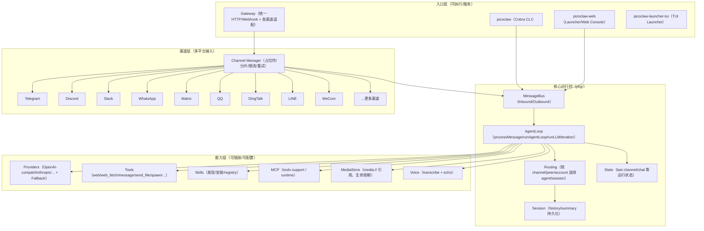
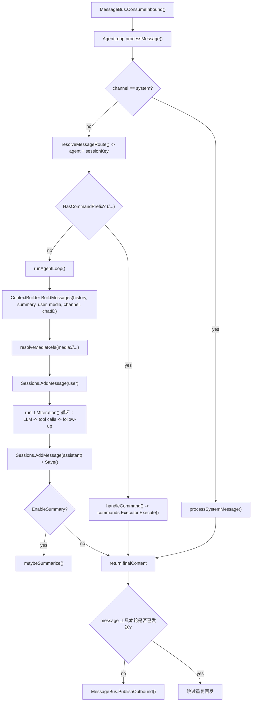
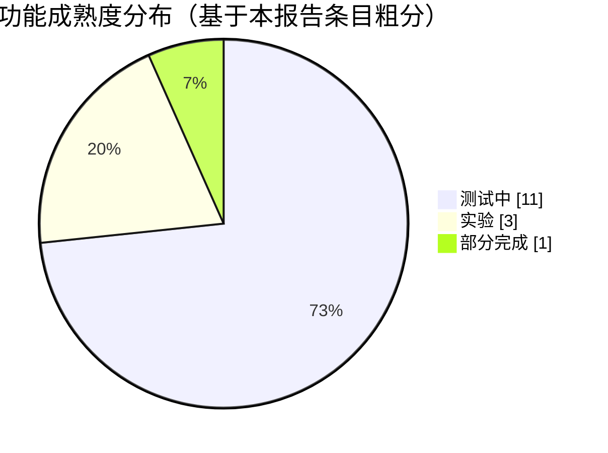
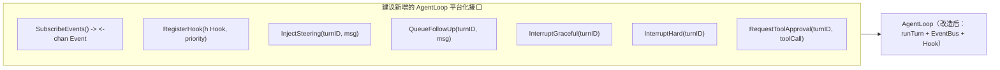

# PicoClaw 源码深度分析报告

## 执行摘要

PicoClaw 是一个以 **Go** 为核心实现的超轻量个人 AI Assistant / AI Agent 运行时，强调在低资源设备上运行（仓库主 README 强调“$10 硬件、<10MB RAM、<1s 启动”，同时也提示近期合并大量 PR 后最新版本可能达到 10–20MB 的占用，并明确处于早期开发阶段、存在潜在网络安全问题，建议 v1.0 前不要上生产）。citeturn19view0

从源码结构看，PicoClaw 的核心运行路径是：**多渠道（CLI、机器人聊天渠道、Web Console）→ 统一的 MessageBus（消息总线）→ AgentLoop（会话/上下文/LLM 迭代/工具调用调度的核心循环）→ LLM Provider（多家模型与兼容 OpenAI 协议的 HTTP Provider）→ Tools/Skills（可插拔工具与技能包）→ 回写 Session/State → Outbound（回发到原渠道）**。这一分层在 `pkg/agent/loop.go` 的 `Run → processMessage → handleCommand/runAgentLoop → runLLMIteration` 中清晰可见。citeturn21view0turn22view0

该仓库已经具备“AI agent 的主干能力”：多 Provider、工具系统（含 web/web_fetch、消息发送、文件发送、硬件 I2C/SPI、技能发现与安装、子代理 spawn 等）、多渠道接入、命令系统（`/show /list /switch /new …` 这类 slash commands）、会话历史与摘要机制等。citeturn19view0turn21view0turn22view0turn36view0  
但近期 issue/roadmap 也指出：**AgentLoop 的可观测性、可 Hook、可中断、可注入消息（steering/follow-up）等“Agent 工程化能力”仍是短板**，并提出事件驱动重构方案；渠道系统与语音链路也在持续重构中（部分阶段标为 partial）。citeturn16search1turn30search1

综合评估：如果你是独立开发者，希望在 PicoClaw 上更好地做 AI agent，最具性价比的方向是 **以现有 AgentLoop/Tools/Providers 为内核，补齐“可观测 + 可控 + 安全边界 + 插件化协议”四件套**；并优先解决 Web Console 无认证、工具执行风险面与权限控制等安全问题。citeturn19view0turn36view0turn33view0

## 项目定位与总体架构

项目定位上，PicoClaw 将自己定义为“Ultra-Efficient AI Assistant in Go”，提供 CLI 交互、网关模式接入多个聊天平台，并提供 Launcher/Web Console 做配置与聊天入口。citeturn19view0turn26view0  
CLI 入口使用 `cobra` 组织子命令：`onboard/agent/auth/gateway/status/cron/migrate/skills/version` 等（见 `cmd/picoclaw/main.go`）。citeturn6view0  
Web 侧在 `web/README.md` 中明确为一个单体目录（monorepo），包含 **Go 后端 + Vite/React 前端**，并将前端构建产物嵌入为一个后端可执行文件。citeturn26view0

下面给出一个“实现级”的架构概览（基于仓库目录与关键入口代码整理），用于你做二次开发时快速定位扩展点：citeturn3view0turn6view0turn21view0turn26view0



关键实现事实（对理解架构很“落地”）：

- **消息总线是核心解耦点**：`AgentLoop.Run()` 持续 `ConsumeInbound`，处理后 再 `PublishOutbound` 回发（并包含“message 工具已在本轮发送则跳过重复回发”的保护）。citeturn21view0  
- **命令系统与 LLM 处理路径分流**：如果消息具有命令前缀（slash command），优先走 `handleCommand`（commands.Executor）；否则进入 LLM/工具迭代循环。citeturn22view0  
- **渠道侧正在工程化重构**：公开 issue 给出“平台消息→Channel→MediaStore→MessageBus→AgentLoop→Outbound→Manager→Channel.Send”的标准化消息流，并标注了阶段进度与 partial 项。citeturn30search1

## 模块清单与职责表

下表按“源码目录级模块”罗列核心职责，并尽量给出证据来源；确实无法从当前已引用的源码片段或仓库文档确认的，标为“未指定/需进一步阅读包内文件”。citeturn3view0turn6view0turn21view0turn22view0turn26view0

| 模块（路径） | 角色定位 | 主要职责（面向架构） | 关键证据（优先源码/README/issues） | 扩展点（做 AI agent 时常改的地方） |
|---|---|---|---|---|
| `cmd/picoclaw` | CLI 主入口 | Cobra 子命令聚合：onboard/agent/gateway/cron/skills 等 | `cmd.AddCommand(...)` 列出子命令。citeturn6view0 | 增加新子命令（如 `audit`、`bench`、`policy`），或把 agent loop 事件输出到 CLI |
| `pkg/agent` | Agent 核心 | `AgentLoop`：消费 Inbound、路由、命令分流、上下文构建、LLM 调用、工具迭代、会话保存、摘要触发等 | `Run/processMessage/handleCommand/runAgentLoop/runLLMIteration`。citeturn21view0turn22view0 | 事件/Hook/中断/审批、工具调度策略、上下文压缩策略、多 Agent 协作编排 |
| `pkg/bus` | 解耦通信层 | MessageBus：Inbound/Outbound 队列、关闭语义、错误处理等（从调用点可见其抽象） | `ConsumeInbound/PublishOutbound` 在 AgentLoop 中被调用。citeturn21view0 | 加 EventBus/Tracing，或为高并发渠道做 backpressure 与优先级 |
| `pkg/routing` | 路由策略 | 将 `channel/peer/account/team/guild` 等输入解析为 `ResolvedRoute`，决定 agent + sessionKey | `resolveMessageRoute` 使用 `registry.ResolveRoute(RouteInput{...})`。citeturn21view0 | 规则热更新、按任务类型/安全级别分流模型与工具、企业多租户路由 |
| `pkg/session` | 会话持久化 | history/summary 管理与保存（从调用点可见接口） | `Sessions.GetHistory/GetSummary/AddMessage/Save/SetHistory` 等在 loop 中使用。citeturn21view0turn22view0 | 引入 vector memory、结构化记忆、分层摘要、审计日志 |
| `pkg/state` | 运行状态 | 记录 last channel/chat 等，用于心跳/通知等能力 | `RecordLastChannel/RecordLastChatID` 与 state manager 调用。citeturn21view0 | 增加“任务队列状态”“长期计划”等 agent state |
| `pkg/channels` | 多渠道接入 | Telegram/Discord/Slack/WhatsApp/Matrix/QQ/钉钉/LINE/WeCom 等渠道适配 + Manager 行为统一 | README 列举渠道；issue #621 给出标准化 inbound/outbound 流。citeturn19view0turn30search1 | 统一 slash commands、渠道鉴权/allowlist、富文本与文件能力一致性 |
| `pkg/commands` | 命令系统 | slash command registry + executor，跨渠道一致行为（Telegram 菜单注册另有渠道侧 UX） | handleCommand 通过 `commands.NewExecutor(...).Execute(...)`。citeturn22view0turn19view0 | 新增命令：/help、/policy、/tools、/trace；命令可观测（事件） |
| `pkg/providers` | LLM 抽象层 | 多 Provider：OpenAI/Anthropic/OpenRouter/Gemini/Zhipu 等 + CLI/OAuth 模式 + fallback | provider selection 与默认 endpoint；providers 目录包含多实现。citeturn25view0turn23view0 | 增加企业私有模型、批量并发/流式、成本与速率治理、路由策略 |
| `pkg/tools` | 工具系统 | 内置工具注册与执行（web/web_fetch/message/send_file/i2c/spi/spawn/…） | `registerSharedTools` 中集中注册 web/web_fetch/message/send_file/skills/spawn 等。citeturn21view0 | 工具权限模型（allow/deny/审批）、工具沙箱、工具观测与回放、MCP 映射 |
| `pkg/skills` | 技能生态 | 技能发现、安装（registry 管理；如 ClawHub） | loop 注册 `find_skills/install_skill`，并从 config 构建 registry manager。citeturn21view0 | 技能签名验证、版本锁定、缓存/索引、企业私有 skill registry |
| `pkg/media` | 媒体生命周期 | MediaStore：将附件抽象为 `media://` 引用并统一清理/传递 | issue #621 解释 MediaStore 与生命周期；loop 中通过 `SetMediaStore` 注入并解析。citeturn30search1turn21view0 | 附件权限（大小/类型/CIDR）、内容抽取（OCR/转写/摘要）、对象存储后端 |
| `pkg/voice` | 语音能力 | 语音转写接口与回显（echo transcription） | loop 中 `SetTranscriber` 与 `transcribeAudioInMessage`、EchoTranscription 控制。citeturn21view0 | 多引擎转写、低资源端侧推理、语音到结构化命令/表单 |
| `pkg/mcp` | MCP 集成 | MCP runtime/manager（工具扩展协议） | release notes 提到 MCP 初始化修复；loop 启动时 `ensureMCPInitialized`。citeturn36view0turn21view0 | MCP 工具元数据与权限、只读/副作用标注、工具编排与监控 |
| `web/backend` + `web/frontend` | Web Console | Launcher：配置中心 + chat console + gateway 生命周期管理；前端为 Vite/React/TanStack Router SPA | web/README 架构说明；backend main 启动 HTTP server、IP allowlist、TryAutoStartGateway；frontend package.json 依赖。citeturn26view0turn33view0turn28view0 | 加认证/授权、审计、工具审批 UI、会话浏览与回放、模型/工具策略配置化 |

## 关键代码路径与调用流程

这一节按“从入口到一次对话完成”的真实调用链路，给出你做改造时最常改的关键路径。

### 核心路径一：从 Inbound 到响应的 AgentLoop 主循环

`pkg/agent/loop.go` 的主循环结构非常明确：`Run()` 初始化并持续消费消息；每条消息进入 `processMessage()`，再分流为命令执行或 LLM 工具迭代，最终写回 session 并（必要时）回发。citeturn21view0turn22view0



上述流程的关键实现证据包括：

- `Run()` 中消费 inbound、调用 `processMessage()`、并在 message tool 已发送的情况下跳过回发，避免重复消息。citeturn21view0  
- `processMessage()` 中对音频转写、system channel 分流、route/sessionKey 解析、command 分流以及进入 `runAgentLoop()` 的逻辑。citeturn21view0turn22view0  
- 命令执行通过 `commands.HasCommandPrefix` 判断后，构建 runtime 并调用 `commands.NewExecutor(...).Execute(...)`。citeturn22view0

为了便于你二次开发时快速落点，下面给出与源码一致的“伪代码级”摘要（只保留会影响架构改造的关键点）：citeturn21view0turn22view0

```text
Run(ctx):
  ensure MCP initialized
  loop:
    msg = bus.ConsumeInbound()
    resp = processMessage(msg)
    if resp != "":
      if messageToolSentInRound(): skip publish
      else bus.PublishOutbound(resp)

processMessage(msg):
  msg = transcribeAudioIfNeeded(msg)
  if msg.Channel == "system": return processSystemMessage(msg)
  route, agent = resolveMessageRoute(msg)
  sessionKey = resolveScopeKey(route, msg.SessionKey)
  opts = {SessionKey, Channel, ChatID, UserMessage, Media, EnableSummary=true, SendResponse=false}
  if handleCommand(msg): return commandReply
  return runAgentLoop(agent, opts)

runAgentLoop(agent, opts):
  history, summary = Sessions.GetHistory/GetSummary unless opts.NoHistory
  messages = ContextBuilder.BuildMessages(history, summary, opts.UserMessage, opts.Media, ...)
  messages = resolveMediaRefs(messages)
  Sessions.AddMessage("user", opts.UserMessage)
  final = runLLMIteration(messages, toolDefs, provider, fallback...)
  Sessions.AddMessage("assistant", final); Sessions.Save()
  maybeSummarize()
  return final
```

### 核心路径二：slash command 的跨渠道统一执行

`handleCommand()` 的实现体现了 PicoClaw 在“跨渠道统一 UX”上的一个关键做法：**命令行为不由各渠道重复实现，而是集中在 AgentLoop，通过 commands.Registry/Executor 处理**。citeturn22view0turn19view0  
这也解释了为何出现“/help 仅 Telegram 支持、其他渠道未覆盖”的 issue：因为 Telegram 在渠道侧有额外处理，但 AgentLoop 的通用命令集合尚未包含 `/help`（issue #569 指出该不一致）。citeturn16search0

从 `handleCommand()` 可直接读出接口契约：输入是 `commands.Request{Channel, ChatID, SenderID, Text, Reply(...)}`，输出 `OutcomeHandled/OutcomePassthrough` 决定是否继续交给 LLM。citeturn22view0  
这对你做 AI agent 很重要：你可以把“高确定性、低成本、无需 LLM 的操作”尽量下沉到命令层，降低 token 成本与降低误触发工具的风险。

### 核心路径三：LLM Provider 选择与多 Provider 适配

Provider 选择发生在 `pkg/providers/factory.go`，其策略为：“优先使用显式 provider 配置；否则从 model 名称推断 provider，再从 config 中取对应 key/api_base/proxy；同时支持若干 CLI/OAuth 模式”。citeturn25view0  
该文件也硬编码了多个 provider 的默认 API Base（例如 OpenAI 默认 `https://api.openai.com/v1`，Anthropic 默认 `https://api.anthropic.com/v1` 等），并覆盖 OpenRouter、LiteLLM、Zhipu、Gemini、vLLM、DeepSeek、Minimax、LongCat、GitHub Copilot 等多种 provider。citeturn25view0

工程侧的直接意义是：你若要做“Agent 的模型路由/成本治理/容灾”，最自然的切入点是 **在 Provider 工厂与 AgentLoop 的 candidate 选择（fallbackChain）之间增加策略层**；而不是在每个 provider 内部打补丁。`runLLMIteration` 中已存在“在一次 turn 内 sticky 的模型选择 + fallback chain 调用”的倾向性实现。citeturn21view0

### Web Console 路径：Launcher 如何管理本地配置与网关

`web/backend/main.go` 显示 Web Console 会：解析 config 路径、确保初始化（`EnsureOnboarded`）、加载 launcher 自己的配置、启动 HTTP server、注册 API 路由与前端静态资源、并在启动后尝试自动启动 gateway 进程。citeturn33view0  
它还包含基于 `AllowedCIDRs` 的 IP allowlist middleware（这是一种“弱认证/网络边界”的工程手段，但不足以替代真正的身份认证）。citeturn33view0

同时，主 README 明确警告：Web Console **尚不支持认证**，不要暴露到公网。citeturn19view0  
因此若你要把 PicoClaw 作为你自己的 agent 平台/产品底座，Web Console 的认证与权限治理几乎必做。

## 功能点与优先级及成熟度评估

本节以“做 AI agent 平台/独立开发者常用能力”为视角，整理功能点，并以 **优先级（P0/P1/P2）** 与 **成熟度（稳定/测试中/实验/部分完成）** 评价。评价依据优先使用 README、release notes、issues 与关键源码路径（见证据列）。citeturn19view0turn21view0turn22view0turn30search1turn36view0

| 功能点 | 价值/场景 | 优先级 | 成熟度（依据） | 证据 |
|---|---|---:|---|---|
| CLI：onboard 初始化与配置 | 首次使用、生成配置、降低门槛 | P0 | 测试中（功能明确、但项目整体早期） | README 快速开始；CLI 命令存在。citeturn19view0turn6view0 |
| CLI：agent 一次性问答/交互 | 最小可用的 agent 体验 | P0 | 测试中 | README 示例（`picoclaw agent -m ...`）。citeturn19view0 |
| Gateway：多渠道接入（Telegram/Discord/WhatsApp/Matrix/QQ/钉钉/LINE/WeCom…） | 让 agent 进入真实聊天场景 | P0 | 测试中（渠道多、但仍在重构） | README 渠道清单；渠道重构 issue 给出进度与 partial。citeturn19view0turn30search1 |
| 命令系统（slash commands）跨渠道统一 | 低成本可控操作（切模型/列渠道/清会话等） | P0 | 测试中（存在不一致待修） | handleCommand 与 Executor；/help 不一致 issue。citeturn22view0turn16search0 |
| LLM Providers：多家模型 + OpenAI 兼容 HTTP + CLI/OAuth 模式 | 替换模型、兼容国产/自建/聚合路由 | P0 | 测试中 | `providers/factory.go` 覆盖多 provider 与默认 endpoint。citeturn25view0turn23view0 |
| FallbackChain（多候选容灾） | 提升可用性（provider 限流/失败时切换） | P1 | 测试中 | loop 中 fallbackChain 使用与“sticky 模型选择”注释。citeturn21view0 |
| 工具：web search（Brave/Tavily/DDG/Perplexity/SearXNG/GLMSearch） | 检索增强、学习、信息整合 | P0 | 测试中 | registerSharedTools 创建 WebSearchTool，含多引擎配置字段。citeturn21view0 |
| 工具：web_fetch（带 proxy 与大小限制） | 抓取网页内容给 LLM 消化 | P0 | 测试中 | registerSharedTools 创建 web_fetch，含 FetchLimitBytes。citeturn21view0 |
| 工具：message（渠道内主动发消息） | 多轮流程中“中间态反馈” | P1 | 测试中 | loop 中 message tool 回调 PublishOutbound，并有“本轮已发送”检测。citeturn21view0 |
| 工具：send_file（附件回传、MediaStore 依赖） | 让 agent 输出文件/图片/报告 | P1 | 测试中（依赖 media 生命周期、存在 cleanup 临时禁用） | send_file tool 注册；media cleanup 暂时禁用注释；MediaStore 注入。citeturn21view0turn30search1 |
| 技能生态：find_skills / install_skill（ClawHub registry） | 可扩展技能市场、让 agent “装能力” | P1 | 实验（生态/供应链风险尚需完善） | loop 内注册工具与 registry manager 配置。citeturn21view0 |
| 子代理：spawn / spawn_status + subagent manager | 多 agent 分工、后台任务 | P1 | 实验（架构仍在演进） | registerSharedTools 注册 spawn/spawn_status 需要 subagent；system message 处理子任务结果。citeturn21view0 |
| 语音转写与回显（EchoTranscription） | 语音输入渠道体验 | P2 | 部分完成（roadmap 标注 partial） | loop 的 transcribeAudioInMessage；渠道重构 issue 标记 Voice 相关阶段 partial 50%。citeturn21view0turn30search1 |
| Web Console（Launcher） | 可视化配置、聊天与管理 | P1 | 测试中（但缺认证） | web/README 定位；README 警告无认证；backend 启动与 allowlist。citeturn26view0turn19view0turn33view0 |
| MCP 工具支持 | 用协议方式接入外部工具生态 | P1 | 测试中（仍有初始化修复） | release notes 修复“direct agent mode 初始化 MCP”；loop 入口 ensureMCPInitialized。citeturn36view0turn21view0 |

为了给你一个“整体成熟度”的直观印象，按上表条目粗略统计：稳定 0、测试中 11、实验 3、部分完成 1（此统计反映的是仓库公开风险提示与 roadmap 状态，而非否定其实用性）。citeturn19view0turn30search1turn36view0



## 技术栈与依赖清单

### 技术栈总览

- **核心语言/运行时**：Go，`go.mod` 指定 `go 1.25.7`。citeturn29view0  
- **Web Console**：`web/README` 指定 Go 1.25+；前端需要 Node.js 20+ 与 pnpm。citeturn26view0  
- **Web 前端工程**：Vite + React + TanStack Router + React Query，依赖版本在 `web/frontend/package.json`。citeturn28view0  
- **核心工程形态**：单仓库，多可执行（CLI、gateway、launcher/web、tui），并提供 Docker Compose 工作流（README 描述）。citeturn19view0turn26view0  

### Go 依赖（节选：对架构最关键的库）

版本来源均为根 `go.mod`。citeturn29view0

| 依赖 | 版本 | 用途定位（按仓库使用场景解释） | 来源链接（官方/上游） |
|---|---:|---|---|
| cobra | v1.10.2 | CLI 命令组织 | `https://github.com/spf13/cobra` |
| gorilla/websocket | v1.5.3 | WebSocket（渠道或 Web Console） | `https://github.com/gorilla/websocket` |
| modernc.org/sqlite | v1.46.1 | SQLite（本地存储/会话/状态的潜在实现基础） | `https://pkg.go.dev/modernc.org/sqlite` |
| anthropic-sdk-go | v1.22.1 | Anthropic provider SDK | `https://github.com/anthropics/anthropic-sdk-go` |
| openai-go/v3 | v3.22.0 | OpenAI provider SDK | `https://github.com/openai/openai-go` |
| discordgo | v0.29.0 | Discord 渠道接入 | `https://github.com/bwmarrin/discordgo` |
| slack-go/slack | v0.17.3 | Slack 渠道接入 | `https://github.com/slack-go/slack` |
| mymmrac/telego | v1.6.0 | Telegram Bot API | `https://github.com/mymmrac/telego` |
| whatsmeow | v0.0.0-20260219… | WhatsApp 接入 | `https://github.com/tulir/whatsmeow` |
| oapi-sdk-go/v3（LarkSuite） | v3.5.3 | 飞书/相关平台 SDK（目录中存在 Feishu 渠道） | `https://github.com/larksuite/oapi-sdk-go` |
| open-dingtalk stream sdk | v0.9.1 | 钉钉接入 | `https://github.com/open-dingtalk/dingtalk-stream-sdk-go` |
| tencent-connect/botgo | v0.2.1 | QQ/腾讯系 bot 能力 | `https://github.com/tencent-connect/botgo` |

补充说明：

- `providers/factory.go` 表明项目不仅依赖 SDK，还大量走“OpenAI-compat HTTP”模式，并通过 config 选择 provider 与 endpoint/proxy。citeturn25view0  
- Go module 下载在部分受限网络环境可能遇到 `proxy.golang.org` 无法访问的问题，issue #487 给出典型报错与建议（对海外/企业内网构建很现实）。citeturn30search0

### Web 前端依赖（节选）

版本来源为 `web/frontend/package.json`。citeturn28view0

| 依赖 | 版本范围 | 用途定位 | 来源链接 |
|---|---:|---|---|
| react / react-dom | ^19.2.0 | SPA UI 核心 | `https://react.dev/` |
| vite | ^7.3.1 | 构建与开发服务器 | `https://vite.dev/` |
| @tanstack/react-router | ^1.167.0 | 前端路由 | `https://tanstack.com/router` |
| @tanstack/react-query | ^5.90.21 | 数据请求与缓存 | `https://tanstack.com/query` |
| i18next + react-i18next | ^25.8.14 / ^16.5.8 | 国际化 | `https://www.i18next.com/` |
| tailwindcss | ^4.2.1 | UI 样式体系 | `https://tailwindcss.com/` |

未指定项：

- pnpm 的具体版本（web/README 仅要求“Node.js 20+ with pnpm”）。citeturn26view0  
- Docker、Docker Compose 的最低版本号（README 提供了 compose 用法，但未给出版本硬约束）。citeturn19view0

## 可扩展性与改造为 AI Agent 的可行性分析

首先要澄清：PicoClaw 本身已经是一个 AI assistant/agent runtime，但从 issue #1316 的“Agent loop 黑盒”描述可见，它距离“可观测、可控、可中断、可注入消息、可审批工具”的工程化 agent 内核仍有差距。citeturn16search1turn21view0turn22view0  
因此你要“更好地做 AI agent”，不是从 0 到 1 搭 loop，而是 **对现有 loop 做平台化增强**，尽量保持其轻量目标。

### 现有架构对扩展友好的点

- **工具注册集中化**：`registerSharedTools` 基于 config 开关注册 web/web_fetch/message/send_file/skills/spawn 等；这意味着你可以用 config 驱动能力开关，或扩展为“按 agent/按租户/按渠道差异化”。citeturn21view0  
- **命令系统已具备统一入口**：`handleCommand` 在 AgentLoop 层统一命令执行，并提供 `Runtime` 注入（可列 agent、列 channel、切 model、清 history 等）。这非常适合扩展为“安全策略命令”“工具审批命令”。citeturn22view0  
- **Provider 工厂已覆盖多终端形态**：除 API key HTTP 模式，还出现 OAuth/token 与 CLI token 等路径（例如 `codex-cli`、`claude-cli`、GitHub Copilot 本地连接模式等）。这为你做“多模型路由”和“企业 SSO/密钥托管”打下基础。citeturn25view0turn23view0

### 关键短板与必要改动

#### 可观测性、Hook、Interrupt、Steering

issue #1316 给出非常明确的问题陈述：当前 loop 无事件、无 hook、无法中断、无法注入消息；且工具执行方式使得在工具间插入检查点困难。citeturn16search1  
如果你要把 PicoClaw 改造成“可做产品/可做复杂 agent workflow”的底座，建议直接将该 issue 的方案作为设计蓝本：EventBus + HookManager + turnState（steering/follow-up 队列 + interrupt 标记）+ 智能工具调度（只读并行/副作用串行）。citeturn16search1

你可以将其接口化为以下公共 API（用于 CLI/Web Console/外部 SDK 接入），并保持与现有 MessageBus 模型兼容（这是 issue #1316 的非目标之一）。citeturn16search1



#### 工具治理与安全边界

从现有代码与 release notes 可以读到两个“安全信号”：

- 主 README 直接警告：项目早期、可能存在网络安全问题，且 Web Console 无认证不要暴露公网。citeturn19view0  
- v0.2.2 的 changelog 出现 “fix(security): harden unauthenticated tool-exec paths”，说明工具执行链路确实被当作攻击面在修补。citeturn36view0  

因此，改造成更强 agent 的同时，必须同步做工具治理：

- **权限模型**：以 `tool` 为单位定义 `capability`（读文件/写文件/执行 shell/发消息/发文件/网络请求等），并把权限配置从“全局 enable/disable”提升到 “per agent / per channel / per user / per network zone”。现有工具注册点集中在 `registerSharedTools`，适合作为注入策略的位置。citeturn21view0  
- **审批链路**：对副作用工具（写文件/exec/spawn/发消息等）引入“默认需审批”的 hook，审批 UI 可放在 Web Console。issue #1316 已给出 ToolApprover 的思想与超时策略。citeturn16search1  
- **沙箱与审计**：特别是 `exec` 类工具（release notes 还出现“exec allow_remote config support”等相关改动），建议引入受限执行环境（chroot/容器/允许命令白名单）与统一审计日志。citeturn36view0

### 数据流设计建议

基于当前 loop 的“messages → provider.Chat → tool calls → session.Save”的结构，你可以把“Agent 平台化数据流”抽象为下面四类数据，并分别落库/落日志：

1) **对话与上下文**（history/summary/messages）  
2) **工具调用轨迹**（tool name、args、结果、耗时、是否审批、是否副作用）  
3) **运行事件流**（TurnStart/ToolExecStart/LLMRequest/LLMResponse/TurnEnd 等）  
4) **长期记忆/知识**（结构化记忆 + 向量检索，可选）

现有实现已经处理了 history/summary 与媒体引用解析，并在 `runLLMIteration` 中有重试与上下文压缩的逻辑信号（检测 context window/token limit，必要时压缩并提醒用户）。citeturn21view0  
因此新增能力更适合做“旁路增强”（事件与 hook），而不是推翻 messages/session 的契约。

### 性能与资源评估

- 性能瓶颈主要在 **LLM 网络调用** 与 **工具 I/O**，而非本地 compute；PicoClaw 的关键主张是低资源可运行，但 README 也坦言合并大量 PR 后内存可能上升到 10–20MB，并计划后续再做资源优化。citeturn19view0  
- 渠道系统重构 issue 明确提到：消息分片、并发、限流、重试（Manager 层）是统一行为的一部分，这类工程化会增加少量内存/CPU，但换来稳定性。citeturn30search1  
- 如果按 issue #1316 引入事件、Hook、审批与中断机制，应注意“低资源设备约束”：事件 fan-out 需非阻塞、订阅者缓冲有限、避免额外 goroutine 泛滥（该 issue 对此已有具体设计约束）。citeturn16search1  

因此在实现上建议：

- EventBus/Hook 默认关闭或采样；  
- 工具执行并行度要区分“只读/副作用”；  
- Web Console 的“审批/回放/监控”尽量做成可选组件，不强绑到核心 gateway 镜像。

## 安全与许可风险与改进路线图

### 许可与合规风险

- 仓库根 `LICENSE` 表明主项目使用 **MIT License**。citeturn35view0  
- 但项目依赖大量第三方 Go modules 与前端 npm 包（版本见 go.mod 与 package.json），这些依赖的许可证类型在本报告中 **未逐一核验（未指定）**，若你要商业化/闭源集成，建议引入自动化 license scanning（Go: `go-licenses`；前端: `license-checker` 等）。citeturn29view0turn28view0

### 安全风险面梳理

高优先级风险点（均来自仓库公开声明或近期变更信号）：

- **项目早期安全告警**：README 明确提示可能存在未解决的网络安全问题，v1.0 前避免上生产。citeturn19view0  
- **Web Console 无认证**：README 警告 Web Console 暂不支持认证，不要暴露至公网。citeturn19view0  
- **工具执行面持续加固**：v0.2.2 changelog 中出现 “fix(security): harden unauthenticated tool-exec paths”，说明“未认证工具执行路径”被认为是攻击面。citeturn36view0  
- **仅靠网络 allowlist 的风险**：虽然 web/backend 有基于 CIDR 的 IP allowlist middleware，但这更像是“外围缓解”，不能替代身份认证、CSRF 防护、权限模型和审计。citeturn33view0  

### 改进建议与实现步骤

考虑你是独立开发者，本路线图按“先把风险面收敛并做平台化增强，再做体验优化”的顺序给出；工时为粗估（默认你熟悉 Go、能读懂现有 pkg 分层）。其中未指定的部分表示需要你结合实际代码进一步核对细节。

| 里程碑 | 目标 | 关键改动点（面向源码落点） | 交付物 | 复杂度 | 估算工时 |
|---|---|---|---|---|---:|
| M1 安全底座 | 让“可用”变成“可控” | Web Console 增加身份认证/会话管理；对 tool-exec 相关 API 加 CSRF/鉴权；默认关闭高危工具或改为审批 | 可上线的本地/内网版 Launcher；安全基线文档 | 高 | 40–80h |
| M2 可观测与可调试 | AgentLoop 不再是黑盒 | 引入 EventBus（Turn/LLM/Tool/Session 事件）；在 Web Console 显示事件流与工具轨迹；日志结构化（release notes 已提到 logger refactor） | 事件订阅 API + Debug UI | 中-高 | 32–60h |
| M3 工具治理与审批 | “能用工具”升级为“工具可治理” | Hook/Approver：在 tool 执行前注入审批与策略；按 tool 声明只读/副作用，控制并行度与检查点（参考 issue #1316） | 工具审批 UI + 策略配置 | 高 | 60–120h |
| M4 统一命令体验 | 用户可发现、跨渠道一致 | 补齐 `/help` 等命令到 AgentLoop 的 commands registry；让渠道菜单注册与运行时一致（解决 #569 类不一致） | 命令帮助与自发现 | 中 | 8–16h |
| M5 Agent 产品化能力 | 真正“AI agent 工作台” | 会话/工具轨迹回放；可导出报告；加入“任务计划/心跳通知”可视化（heartbeat/cron 相关模块存在但细节未指定） | 任务面板 + 回放 | 中 | 40–80h |
| M6 资源优化回归 | 贴近低资源目标 | profiling（pprof）、减少 goroutine/缓存大小、降低前端打包体积与后端常驻内存；对渠道与工具做 lazy init | 资源基线（<10–20MB 目标） | 中 | 24–60h |

关键引用链接已在文中以可点击引用形式分散标注（主要包括：主 README、web/README、核心 `pkg/agent/loop.go`、`cmd/picoclaw/main.go`、`providers/factory.go`、`go.mod`、前端 `package.json`、Releases 与关键 issues）。citeturn19view0turn26view0turn22view0turn6view0turn25view0turn29view0turn28view0turn36view0turn16search1turn30search1turn16search0turn35view0