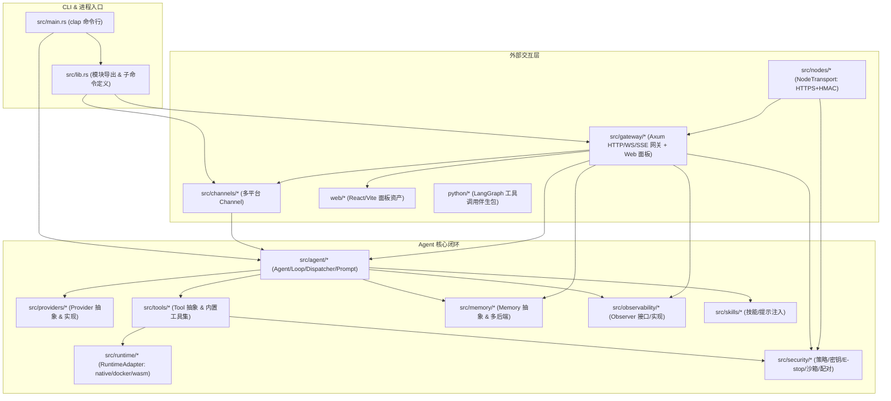

# ZeroClaw 仓库源码深度研究报告

## 执行摘要
ZeroClaw 是一个以 **Rust 单一二进制**为核心的 AI Agent 基础设施：通过统一的 **Provider（模型提供方）/Tool（工具）/Channel（消息渠道）/Memory（记忆）/Runtime（运行时）**抽象，把“对话→推理→工具执行→记忆→多渠道交互→Web 网关/面板”串成可部署、可替换、可扩展的闭环；并在安全侧内建加密密钥库、E-stop、策略与网关防护，适合独立开发者以“加模块即增强能力”的方式迭代。 citeturn10view1turn16view0turn36view0turn40view0turn39view0

## 读者假设与研究范围
本报告默认你具备常见后端/前端/ML 技术背景，但对该项目内部结构不熟悉；因此我会以“源码目录→接口抽象→数据流→可扩展点”的方式展开，并在关键结论处标注来源。若运行平台或语言版本在仓库中未出现明确约束，则标注为“未指定”。

研究范围以仓库主工程（Rust）为主，并覆盖同仓库的前端 Web（`web/`）与 Python 伴生包（`python/`）。主工程 `Cargo.toml` 显示：包名 `zeroclawlabs`，版本 `0.4.3`，Rust edition 为 2021，最低 Rust 版本声明为 `1.87`；同时 release profile 强调“体积优先”（`opt-level=z`、`lto=fat`、`codegen-units=1`），符合“低资源设备”定位。 citeturn10view0turn10view1turn10view4  
CI 工作流则固定使用 Rust `1.92.0`（与 `rust-version=1.87` 存在“CI 更高/更严”的差异），并在 Linux/macOS/Windows 上做构建矩阵。 citeturn54view0turn54view1  
前端 `web/package.json` 使用 `React 19`、`react-router-dom`、`TailwindCSS`、`Vite`、`TypeScript`；构建脚本为 `tsc -b && vite build`。 citeturn54view3turn12view0  
Python 伴生包 `zeroclaw-tools` 需求 Python `>=3.10`，依赖 `langgraph/langchain-*` 与 `httpx`，定位为“LangGraph 风格的一致工具调用层”。 citeturn54view2turn7view0

## 软件架构设计
### 模块/组件关系图（mermaid）


### 模块职责、接口与依赖关系
Agent 的核心对象 `Agent` 聚合了 `Provider`、`Tool` 列表与其 `ToolSpec`、`Memory`、`Observer`、`SystemPromptBuilder`、`ToolDispatcher`、`MemoryLoader`，以及模型名/温度/工作区/技能/路由提示等配置字段，体现“组合优先”的架构风格。 citeturn50view0  

* Provider（LLM 适配层）：`Provider` trait 定义了能力探测（capabilities）、工具声明转换（`convert_tools`）、结构化 `chat` 等；其关键点是**在 provider 不支持原生函数调用时，自动把工具说明注入 system prompt**（PromptGuided fallback），从而保证工具调用链在不同模型 API 上行为一致。 citeturn20view0turn20view2turn20view4  
* Tool（能力执行层）：`Tool` trait 以 `name/description/parameters_schema/execute` 统一工具注册与执行结果 `ToolResult{success,output,error}`，使“工具是可插拔能力单元”。 citeturn22view0  
* Channel（多端入口层）：`Channel` trait 以 `send/listen` 为核心，并额外支持 typing 指示、草稿更新、reaction、pin 等“平台差异能力”，便于把 agent 输出映射到不同 IM/协作平台交互范式。 citeturn34view0  
* Memory（记忆与检索）：`Memory` trait 支持 `store/recall/get/list/forget/count/health_check`，并带有 `MemoryCategory`（core/daily/conversation/custom），为“长期事实/会话上下文/日志”分层提供直接数据结构支撑。 citeturn25view3turn25view0  
* Runtime（执行环境抽象）：`RuntimeAdapter` 抽象了 shell/文件系统/长驻能力/存储路径/内存预算，并要求实现 `build_shell_command`，为 native/docker/wasm 等不同“执行隔离”方案提供统一接口。 citeturn28view1turn28view2  
* Security（纵深防御）：安全策略 `SecurityPolicy` 内建自主级别（ReadOnly/Supervised/Full）、命令 allowlist、路径 black-list、单位时间动作计数、成本上限等约束，并实现“对 shell 命令做最小词法解析（识别分隔符/引号/变量展开）以防绕过”的思路；同时 SecretStore 用 ChaCha20-Poly1305 把 API key 等写入加密密文（`enc2:`），密钥文件权限收紧（0600）。 citeturn38view0turn40view0  

### 数据流（对话→工具→记忆）与错误处理
一次典型 turn 在 `Agent::turn` 中启动：若历史为空先构建 system prompt；可选 auto-save 把用户消息写入 `MemoryCategory::Conversation`；随后 `MemoryLoader` 把检索上下文注入用户输入，再进入 provider 调用与工具执行循环。 citeturn50view3turn45view0  
工具执行侧：若找到工具则调用 `tool.execute` 并记录观测事件；若执行失败（Err）或工具返回 `success=false`，会把错误格式化为文本返回给模型；若 tool 名不存在，则返回 “Unknown tool”。这属于“以文本回传模型做自愈”的典型 agent 处理方式。 citeturn50view4turn22view0  

### 部署拓扑（单机/容器/分布式）与扩展点
* 单机：以 `zeroclaw agent` 交互模式运行，或通过 `zeroclaw daemon` 启动“长驻自治运行时（gateway+channels+heartbeat+scheduler）”。 citeturn14view4turn14view3  
* 容器化：示例 `docker-compose.yml` 直接运行 `ghcr.io/...:latest`，暴露网关端口（默认 42617），以环境变量注入 API_KEY/PROVIDER 等，并要求容器内允许 public bind。 citeturn52view0  
* 分布式/多节点：`NodeTransport` 以“HTTPS + HMAC-SHA256 + timestamp/nonce”方式进行对等节点请求签名与验签，强调走 443、兼容企业代理/审计；适合扩展为多节点控制面或远程执行。 citeturn32view0turn31view0  
* Web 面板：`build.rs` 在检测到 npm 时会尝试构建 `web/dist`，失败则降级为占位目录以保证 Rust 构建可继续；`gateway` 侧通过 `rust-embed` 等思路把前端资产嵌入二进制或提供静态文件服务。 citeturn12view0turn36view0turn10view3  

扩展点总体集中在四类 trait 上：`Provider`、`Tool`、`Channel`、`RuntimeAdapter`；此外 config schema 与 feature flags（如 `rag-pdf`、`observability-otel`、sandbox 相关特性）提供“按需裁剪/按需开启”的工程扩展面。 citeturn20view1turn22view0turn34view0turn28view1turn10view4  

## 功能点与源码映射
### 功能→源码映射表
| 功能（核心/次要） | 实现要点（简述） | 主要源码位置 |
|---|---|---|
| 核心：Agent 回合制编排（turn、历史、工具链） | system prompt 初始化、记忆注入、工具并发/串行、history 维护 | `src/agent/agent.rs`；`src/agent/*` citeturn50view0turn46view0 |
| 核心：多 LLM Provider 抽象与兼容工具调用 | 能力探测；原生工具调用/PromptGuided 降级；streaming 框架 | `src/providers/traits.rs`；`src/providers/*.rs` citeturn20view1turn17view0 |
| 核心：工具系统（注册、schema、执行结果） | `ToolSpec` + JSON schema；`ToolResult` 标准结构 | `src/tools/traits.rs`；`src/tools/*` citeturn22view0turn21view0 |
| 核心：多渠道接入（收/发、草稿更新等） | `ChannelMessage/SendMessage`；draft/typing/reaction/pin 扩展能力 | `src/channels/traits.rs`；`src/channels/*` citeturn34view0turn33view0 |
| 核心：HTTP/WS 网关 + 配对/限流/幂等 | Axum 网关；64KB body limit；30s timeout；滑窗限流；idempotency；pairing guard | `src/gateway/mod.rs`；`src/gateway/*` citeturn36view0turn10view3 |
| 核心：记忆抽象与分类 | store/recall/get/list/forget；MemoryCategory 分层 | `src/memory/traits.rs`；`src/memory/*` citeturn25view0turn23view0 |
| 核心：运行时抽象（native/docker/wasm） | shell/FS/长驻能力/存储路径；构造 shell command | `src/runtime/traits.rs`；`src/runtime/*` citeturn28view1turn26view0 |
| 核心：安全策略与密钥管理 | 自主级别；命令/路径策略；动作频控；密钥 ChaCha20-Poly1305 加密 | `src/security/policy.rs`；`src/security/secrets.rs` citeturn38view0turn40view0 |
| 核心：E-stop（kill/network/domain/tool）与可选 OTP 恢复 | fail-closed；状态文件原子写；resume 可要求 OTP | `src/security/estop.rs` citeturn39view0 |
| 次要：多节点安全传输（NodeTransport） | HMAC-SHA256 签名；timestamp/nonce 防重放；HTTPS 443 | `src/nodes/transport.rs` citeturn32view0turn31view0 |
| 次要：前端 Web 面板（React/Vite） | React Router；Tailwind；Vite 构建；由 build.rs 触发构建/降级 | `web/package.json`；`build.rs` citeturn54view3turn12view0 |
| 次要：Python 伴生包（LangGraph 工具调用） | `zeroclaw-tools` CLI；LangGraph/ LangChain 生态依赖 | `python/pyproject.toml`；`python/README.md` citeturn54view2turn7view0 |
| 次要：容器化部署示例 | 通过 env 注入 key/provider；暴露网关端口；资源限制 | `docker-compose.yml` citeturn52view0 |
| 次要：CI 质量门禁 | fmt/clippy/nextest；跨平台 build；docs quality；PR 安全审计 | `.github/workflows/*.yml` citeturn54view0turn54view1turn51view0 |

### 关键流程与测试覆盖
Agent 编排的“核心算法”更接近工程化状态机：**(1) system prompt 建立 → (2) 记忆上下文注入 → (3) provider chat → (4) 解析工具调用 → (5) 执行工具并回填结果 → (6) 直到产出最终文本**；其正确性主要由集成测试兜底。测试目录中 `tests/integration/agent.rs` 明确宣称是“端到端编排测试”，使用 mock provider/tool 验证文本响应、单工具/多工具链、并行工具调度、未知工具恢复，以及“记忆注入会真实进入 provider 请求”的历史保真。 citeturn45view0turn50view3turn50view4  
安全与可靠性测试覆盖较“工程化”：例如 `EstopManager` 在 state 文件损坏时进入 fail-closed（默认 kill_all）、resume 可要求 OTP、写入采用临时文件 + rename 的原子替换，并有对应单测验证。 citeturn39view0  
同样地，`Tool`/`Memory`/`RuntimeAdapter`/`Channel`/`Provider` 等核心 trait 文件普遍带 `#[cfg(test)]` 单测，保证抽象层契约稳定。 citeturn22view0turn25view4turn28view3turn34view0turn19view3  

## 技术栈与工程化
语言与框架组成呈现“Rust 主干 + Web 面板 + Python 生态桥接”的三层：
* Rust 主工程：CLI 使用 `clap`；异步运行时基于 `tokio`；HTTP 网关基于 `axum`/`tower-http`；日志与观测使用 `tracing`，并提供可选 `opentelemetry-otlp`；前端资产嵌入使用 `rust-embed`；本地存储默认走 `rusqlite(bundled)`，并存在 `postgres` 可选依赖；WebSocket 多渠道用 `tokio-tungstenite` 等。 citeturn10view1turn10view3turn10view4  
* 安全相关：SecretStore 使用 `ChaCha20-Poly1305`（AEAD）并将 key 文件权限收紧；安全策略实现了对命令字符串的最小词法解析以防“引号/分隔符注入绕过”；网关侧声明了 body 限制与 timeout 来抵御 slow-loris，并实现滑窗限流与幂等 key 存储（基于内存 map + TTL/淘汰）。 citeturn40view0turn38view0turn36view0  
* 前端 Web：`React` + `react-router-dom` + `TailwindCSS` + `Vite` + `TypeScript`。`build.rs` 会在 `web/dist` 缺失时尝试 `npm ci`/`npm install` 并构建，否则降级为占位目录，避免强依赖 Node。 citeturn54view3turn12view0  
* Python 伴生包：用 `hatchling` 打包，依赖 `langgraph/langchain-core/langchain-openai/httpx`，并暴露 `zeroclaw-tools` 脚本入口；可选依赖提供 `discord.py`、`python-telegram-bot`。 citeturn54view2turn7view0  

CI/CD 与质量门禁较完整：  
`ci-run.yml` 在 push/PR 上执行格式化检查、Clippy、nextest 测试、跨平台 release 构建矩阵，并有 docs quality gate；`checks-on-pr.yml` 额外加入 `cargo-audit` 与 `cargo-deny` 进行依赖漏洞与许可证/来源检查，并做 32-bit `--no-default-features` 的兼容性检查，最后以 gate job 汇总结果，便于分支保护只依赖单个状态检查。 citeturn54view0turn54view1turn51view0  

容器化与配置管理：仓库提供 `docker-compose.yml` 示例，环境变量注入 provider 与 API key；同时 README 指出当启用 Docker sandbox runtime（`runtime.kind="docker"`）时才需要安装 Docker。 citeturn52view0turn11view2

## 面向 AI agent 的改进建议
以下建议以“与你作为独立开发者快速落地”为优先级，尽量复用现有抽象（Provider/Tool/Memory/Runtime/SecurityPolicy/Observer），并给出步骤、难度、风险与收益。

建议一：把 Agent 回合编排显式化为“可观测状态机/图”
实现步骤：在 `src/agent/loop_.rs`/`dispatcher.rs`（现有分层）基础上，引入显式 TurnState（Planning/CallingTools/ToolResult/Finalizing/Error），每个状态产出结构化事件（span + JSON）；并把“并行工具/串行工具/最大循环次数/失败重试”做成可配置策略。难度：中。风险：改动面涉及 turn 逻辑与测试；需保证与现有集成测试保持一致。预期收益：调试与线上行为可解释性显著提升，便于后续引入多模型路由与自修复。 citeturn45view0turn50view3turn54view0  

建议二：工具调用加入“权限分级 + 交互式审批统一层”
实现步骤：把 `SecurityPolicy` 的风险判定与 `AutonomyLevel`（ReadOnly/Supervised/Full）与工具元信息（ToolOperation: Read/Act）整合：ToolSpec 增加 `operation` 与 `risk_hint`；在 `ToolDispatcher` 入口统一拦截，Supervised 下对 Medium/High 风险生成“审批请求”，可通过 CLI prompt 或 gateway API 完成批准。难度：中。风险：审批交互若处理不好会降低体验；需避免 deadlock。预期收益：把“安全策略→执行约束→人类在环”闭环打通，适合独立开发者在真实环境中安全放权。 citeturn38view0turn50view4turn22view0  

建议三：把 Memory 从“召回 API”升级为“可插拔检索管道（Keyword + Vector + Cache）”
实现步骤：利用现有 `Memory` 抽象与分类（Core/Daily/Conversation），把 `recall` 扩展为：先查 `response_cache`（已有模块暗示），再做 keyword recall，最后做可选向量检索（如 Qdrant 后端已有入口/配置类型）；并把“记忆注入模板”从纯文本拼接升级为结构化块（facts/logs/recent/tool-results）。难度：中-高。风险：向量检索引入 embedding 成本与一致性问题；需加限流与预算。预期收益：在长会话与多任务场景下，模型上下文更稳定，token 利用更高。 citeturn23view0turn25view0turn45view0turn42view0  

建议四：为 Provider 调用加入“可靠性中间层”（超时/重试/熔断/降级）
实现步骤：在 Provider trait 外围加一个 `ReliableProvider` 装饰器（仓库已有 `reliable.rs/router.rs` 文件名暗示），统一实现：请求超时、指数退避重试、错误分类（429/5xx/网络）、模型降级链（例如优先快模型，失败切换稳定模型），并把 token/cost/latency 写入 `CostTracker` 与 `Observer`。难度：中。风险：重试可能放大成本；需要与 E-stop（network_kill）联动。预期收益：对独立开发者来说“少盯着跑”更现实，且能稳定支撑 daemon 长驻。 citeturn17view0turn19view2turn39view0turn36view0  

建议五：网关侧增加“安全事件流 + 可视化审计”
实现步骤：复用 gateway 已有 SSE/WS 组件与 `Audit/ObserverEvent`（安全目录有 `audit.rs`），把关键事件（pairing、rate limit 命中、webhook 验签失败、estop 状态变化、工具冻结/恢复、敏感命令拦截）统一为事件流；前端面板新增“审计页”与过滤检索。难度：中。风险：事件字段设计不当会泄露敏感信息；需与 SecretStore 规则一致（不输出明文 key）。预期收益：上线后可观测性与安全可控性大幅提升，适合放到家用/公司内网长期运行。 citeturn36view0turn40view0turn39view0turn54view3  

建议六：把“多节点 NodeTransport”落到可用的任务分发/远程执行 MVP
实现步骤：基于 `NodeTransport::send` 的 HMAC 签名请求，定义最小远程 API：`/api/node-control/run-tool`、`/health`、`/capabilities`；服务端复用 gateway 路由，接入 SecurityPolicy（workspace boundary + tool freeze）与审计。先做“只读工具”远程化（如 web_fetch、file_read），再逐步开放执行类工具。难度：高。风险：分布式带来身份与密钥轮换、回放窗口、跨节点一致性等新问题。预期收益：把 ZeroClaw 从“单机 agent”升级为“边缘节点协作”的平台能力，适合你做更强的 AI agent 系统化产品。 citeturn32view0turn28view1turn38view0turn39view0  

## 结论与下一步行动建议
从源码结构看，ZeroClaw 的核心价值不是某个单点算法，而是把 agent 系统拆成稳定的接口层：Provider/Tool/Channel/Memory/Runtime/Security/Observability，并提供网关与 daemon 形态把它“部署成服务”。 citeturn16view0turn50view0turn36view0turn14view3  

如果你要“更好地做 AI agent”，建议按以下顺序落地（尽量少改核心、先扩展能力）：
1) 先读 `src/agent/agent.rs` 与 `tests/integration/agent.rs`，把 turn 的输入输出与工具循环摸透；用 mock provider 复现实验，保证你改动不破坏 E2E。 citeturn50view3turn45view0  
2) 若你要接入新模型或统一多模型：以 `src/providers/traits.rs` 的 `chat/convert_tools/capabilities` 为入口，实现一个新 Provider；优先保持“PromptGuided 降级路径”仍可工作。 citeturn20view1turn20view2  
3) 若你要加业务能力：实现新 `Tool` 并注册到 Agent；先通过 SecurityPolicy 设计好 read/act 边界，再逐步放权。 citeturn22view0turn38view0  
4) 若你要服务化部署：用 `docker-compose.yml` 起一个网关实例，确认面板与 webhook/rate limit/pairing 工作，再迁移到 daemon。 citeturn52view0turn36view0  

仓库可能的“信息缺口/需补充点”：  
* 配置项总体极多（`src/config/schema.rs` 体量很大，报告未逐字段展开），建议用项目内置的 “config schema 导出”子命令生成 JSON Schema 并做二次文档/类型绑定（仓库已提供相应命令骨架）。 citeturn14view0turn42view0  
* Docker sandbox、WASM runtime、RAG PDF 等能力为 feature-gated/可选依赖，真实可用性依赖你启用的 feature 与运行平台；建议用 CI 的 `--no-default-features` 思路，在本地也建立“最小特性集”与“全特性集”两套构建配置。 citeturn10view4turn54view1  

## 优先参考来源
### 仓库内优先文件（按“理解→扩展→部署”排序）
* `src/agent/agent.rs`：Agent 组合对象、turn 主流程、工具执行与并发策略。 citeturn50view0turn50view3turn50view4  
* `src/providers/traits.rs`：Provider 能力探测、工具调用兼容层（PromptGuided fallback）、流式接口框架。 citeturn20view0turn20view2turn20view4  
* `src/tools/traits.rs`：Tool 接口、ToolSpec/ToolResult 结构。 citeturn22view0  
* `src/channels/traits.rs`：Channel 抽象与平台能力扩展点。 citeturn34view0  
* `src/memory/traits.rs`：Memory 抽象、分类体系。 citeturn25view3turn25view0  
* `src/gateway/mod.rs`：Axum 网关、安全护栏（限流/幂等/配对/超时/body limit）、与 memory/tools/channels 的粘合层。 citeturn36view0  
* `src/security/policy.rs`、`src/security/secrets.rs`、`src/security/estop.rs`：策略/加密密钥库/E-stop 的纵深防御实现。 citeturn38view0turn40view0turn39view0  
* `src/runtime/traits.rs`：运行时适配抽象（native/docker/wasm）。 citeturn28view1turn28view2  
* `tests/integration/agent.rs`：端到端编排行为的最直接“规格说明”。 citeturn45view0  
* `.github/workflows/*.yml`：质量门禁与供应链安全实践（audit/deny/nextest/跨平台）。 citeturn51view0turn54view0turn54view1  
* `Cargo.toml`、`build.rs`：依赖全景、feature flags、体积优化、Web 构建策略。 citeturn10view1turn10view4turn12view0  
* `web/package.json`、`python/pyproject.toml`：前端与 Python 伴生生态依赖清单。 citeturn54view3turn54view2  
* `docker-compose.yml`：容器化运行与网关暴露参数。 citeturn52view0  

### 外部官方文档链接（建议用于二次设计/落地）
```text
Tokio: https://tokio.rs/
Axum: https://docs.rs/axum/
tracing: https://docs.rs/tracing/
OpenTelemetry（Rust）: https://opentelemetry.io/docs/languages/rust/
ChaCha20-Poly1305（IETF RFC 8439 背景）: https://www.rfc-editor.org/rfc/rfc8439
LangGraph: https://github.com/langchain-ai/langgraph
cargo-nextest: https://nexte.st/
cargo-audit: https://github.com/rustsec/rustsec/tree/main/cargo-audit
cargo-deny: https://github.com/EmbarkStudios/cargo-deny
Vite: https://vitejs.dev/
React: https://react.dev/
Tailwind CSS: https://tailwindcss.com/
```